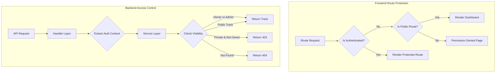

# Design Document: Access Control Bug Fixes

## Overview

This design addresses five access control bugs in the Personal Music Search Engine. The fixes span backend service layer enforcement, proper HTTP status codes, and frontend route protection for guest users.

## Steering Document Alignment

### Technical Standards
- Go backend with existing service/repository pattern
- DynamoDB single-table design with GSI3 for public track discovery
- TDD with 80%+ coverage requirement
- React frontend with TanStack Router for route protection

### Project Structure
- Backend fixes in `backend/internal/service/track.go` and `backend/internal/handlers/track.go`
- Frontend route guards in `frontend/src/routes/__root.tsx`
- New permission denied page at `frontend/src/routes/permission-denied.tsx`

## Code Reuse Analysis

### Existing Components to Leverage
- **AuthContext**: Already extracts `HasGlobal` permission for admin detection
- **TrackVisibility model**: `models.TrackVisibility` with `private`, `unlisted`, `public` values
- **GSI3**: Public track indexing already exists for discovery
- **useAuth hook**: Provides `isAuthenticated`, `isAdmin`, `role` for frontend checks
- **models.NewForbiddenError**: Already exists for 403 responses

### Integration Points
- **Track Service**: Modify `GetTrack` and `ListTracks` to check visibility
- **Track Handler**: Pass `HasGlobal` context to service layer
- **Repository**: Add method to query tracks with visibility filter
- **Frontend Router**: Add route guards for guest users

## Architecture



### Modular Design Principles
- **Single File Responsibility**: Visibility logic in dedicated service methods
- **Component Isolation**: Route guards in root layout, not individual routes
- **Service Layer Separation**: All authorization checks in service layer, handlers just pass context

---

## Components and Interfaces

### Component 1: Track Visibility Service Methods

**Purpose:** Enforce visibility rules at service layer for all track operations.

**Interfaces:**
```go
// Enhanced GetTrack with visibility check
func (s *trackService) GetTrack(ctx context.Context, requesterID, trackID string, hasGlobal bool) (*models.TrackResponse, error)

// Enhanced GetTrackWithVisibilityCheck - internal helper
func (s *trackService) canAccessTrack(track *models.Track, requesterID string, hasGlobal bool) (bool, error)

// ListTracks already has GlobalScope in filter - ensure visibility filtering
func (s *trackService) ListTracks(ctx context.Context, requesterID string, filter models.TrackFilter) (*repository.PaginatedResult[models.TrackResponse], error)
```

**Dependencies:** Repository, models.TrackVisibility

**Reuses:** Existing track service methods, models.NewForbiddenError

### Component 2: Track Handler Auth Context

**Purpose:** Pass full auth context (including HasGlobal) to service layer.

**Interfaces:**
```go
// GetTrack handler - pass HasGlobal to service
func (h *Handlers) GetTrack(c echo.Context) error {
    auth := getAuthContext(c)
    track, err := h.services.Track.GetTrack(ctx, auth.UserID, trackID, auth.HasGlobal)
}
```

**Dependencies:** Auth middleware, service layer

**Reuses:** Existing getAuthContext helper

### Component 3: Guest Route Guard

**Purpose:** Restrict guest users to dashboard-only access.

**Interfaces:**
```tsx
// In __root.tsx or a RouteGuard component
interface RouteGuardProps {
  children: React.ReactNode;
}

// Public routes that guests can access
const PUBLIC_ROUTES = ['/', '/login', '/permission-denied'];

function RouteGuard({ children }: RouteGuardProps) {
  const { isAuthenticated } = useAuth();
  const location = useLocation();

  if (!isAuthenticated && !PUBLIC_ROUTES.includes(location.pathname)) {
    return <Navigate to="/permission-denied" />;
  }

  return children;
}
```

**Dependencies:** useAuth hook, TanStack Router

**Reuses:** Existing auth hook and router setup

### Component 4: Permission Denied Page

**Purpose:** Display clear message for unauthorized access with navigation back to dashboard.

**Interfaces:**
```tsx
export default function PermissionDeniedPage() {
  return (
    <div>
      <h1>Access Denied</h1>
      <p>You do not have permission to view this page.</p>
      <Link to="/">Return to Dashboard</Link>
    </div>
  );
}
```

**Dependencies:** TanStack Router Link

**Reuses:** Existing page layout patterns

### Component 5: Admin User Detail Modal Fix

**Purpose:** Fix the error when clicking on search results in admin user management.

**Investigation Required:** The modal component and hooks appear correct. Need to verify:
1. API endpoint returns expected UserDetails shape
2. No null pointer errors in stats rendering
3. Modal state cleanup on close

---

## Data Models

### TrackVisibility (existing)
```go
type TrackVisibility string

const (
    VisibilityPrivate  TrackVisibility = "private"   // Only owner can see
    VisibilityUnlisted TrackVisibility = "unlisted"  // Direct link access
    VisibilityPublic   TrackVisibility = "public"    // Discoverable by all
)
```

### TrackFilter (enhanced)
```go
type TrackFilter struct {
    // Existing fields
    Limit       int
    Cursor      string
    Artist      string
    Album       string
    Genre       string
    Tags        []string
    SortBy      string
    SortOrder   string

    // Access control fields
    GlobalScope bool  // If true, return all tracks (admin)

    // New: For non-global queries, filter by visibility
    // When GlobalScope=false, automatically filter to:
    // - Tracks owned by requester, OR
    // - Tracks with visibility=public
}
```

### AuthContext (existing)
```go
type AuthContext struct {
    UserID    string
    Role      models.UserRole
    HasGlobal bool  // True for admin users
}
```

---

## Error Handling

### Error Scenarios

1. **Non-owner accessing private track**
   - **Handling:** Return `models.NewForbiddenError("you do not have permission to access this track")`
   - **HTTP Status:** 403 Forbidden
   - **User Impact:** Clear message that track exists but is not accessible

2. **Track does not exist**
   - **Handling:** Return `models.NewNotFoundError("Track", trackID)`
   - **HTTP Status:** 404 Not Found
   - **User Impact:** Message that track was not found

3. **Non-owner accessing unlisted track without direct link**
   - **Handling:** Return `models.NewNotFoundError("Track", trackID)` (hide existence)
   - **HTTP Status:** 404 Not Found
   - **User Impact:** Track appears to not exist (security through obscurity)

4. **Guest accessing protected route**
   - **Handling:** Redirect to `/permission-denied`
   - **User Impact:** Clear message with button to return home

5. **Admin modal API error**
   - **Handling:** Display error alert in modal
   - **User Impact:** Can close modal and retry

---

## API Changes

### GET /api/v1/tracks/:id

**Current Behavior:** Returns 404 if track not owned by requester

**New Behavior:**
- If `hasGlobal=true` (admin): Return track regardless of visibility
- If `requesterID == track.UserID` (owner): Return track
- If `track.Visibility == public`: Return track
- If `track.Visibility == private` and not owner: Return 403 Forbidden
- If track doesn't exist: Return 404 Not Found

### GET /api/v1/tracks

**Current Behavior:** Returns all tracks when `GlobalScope=true`, user's tracks otherwise

**New Behavior:**
- If `GlobalScope=true` (admin): Return all tracks (no change)
- If `GlobalScope=false`:
  - Return tracks where `userID == requester` OR `visibility == public`
  - Apply any additional filters (artist, album, tags, etc.)

---

## Testing Strategy

### Unit Testing

**Backend Service Tests:**
- `TestGetTrack_OwnerCanAccessPrivate` - Owner can access their private tracks
- `TestGetTrack_AdminCanAccessAnyTrack` - Admin with HasGlobal can access all tracks
- `TestGetTrack_NonOwnerCantAccessPrivate` - Non-owner gets 403 for private tracks
- `TestGetTrack_NonOwnerCanAccessPublic` - Non-owner can access public tracks
- `TestGetTrack_NotFound` - Non-existent track returns 404
- `TestListTracks_SubscriberSeesOwnAndPublic` - Filtered results for subscribers
- `TestListTracks_AdminSeesAll` - Unfiltered results for admins

**Frontend Tests:**
- `TestRouteGuard_GuestRedirectsToPermissionDenied` - Guest accessing protected route
- `TestRouteGuard_GuestCanAccessDashboard` - Guest can view dashboard
- `TestRouteGuard_AuthenticatedUserCanAccessAll` - Logged in users have full access
- `TestPermissionDeniedPage_RendersCorrectly` - Page displays message and button

### Integration Testing

- Full flow: Subscriber lists tracks → only sees own + public
- Full flow: Subscriber clicks private track → receives 403
- Full flow: Admin lists tracks → sees all tracks
- Full flow: Guest navigates to /tracks → redirected to permission denied

### End-to-End Testing

- Subscriber login → browse tracks → verify no private tracks from others visible
- Admin login → search user → click user card → modal displays correctly
- Guest visit → click navigation → see permission denied → click home button
