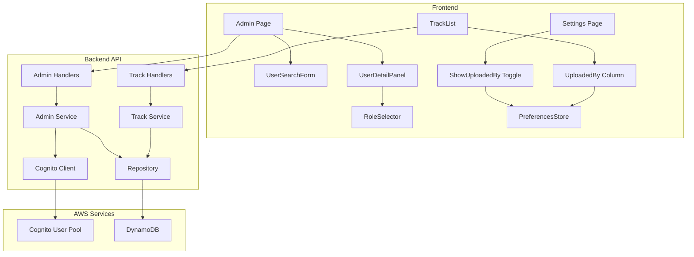

# Design Document: Admin Panel & Track Visibility

## Overview

This design adds administrative user management capabilities and track visibility controls to the Personal Music Search Engine. It builds upon the existing role-based access control system (global-user-type) to provide a complete admin experience and multi-user content discovery.

## Steering Document Alignment

### Technical Standards (tech.md)
- Go backend with existing service/repository pattern
- DynamoDB single-table design following existing PK/SK patterns
- **Cognito Admin API** for user group management
- React frontend with TanStack Router/Query
- Zustand for client-side preferences

### Project Structure (structure.md)
- Backend handlers in `backend/internal/handlers/admin.go`
- Backend service in `backend/internal/service/admin.go`
- Frontend admin page in `frontend/src/routes/admin/`
- Frontend components in `frontend/src/components/admin/`

## Code Reuse Analysis

### Existing Components to Leverage
- **RoleService** (`backend/internal/service/role.go`): Extend with Cognito admin operations
- **VisibilitySelector** (`frontend/src/components/playlist/VisibilitySelector.tsx`): Reuse for track visibility
- **PreferencesStore** (`frontend/src/lib/store/preferencesStore.ts`): Add "showUploadedBy" preference
- **AuthContext/useAuth** (`frontend/src/hooks/useAuth.ts`): Use for admin route protection
- **TrackFilter** (`backend/internal/models/track.go`): Extend with visibility filtering

### Integration Points
- **Cognito**: Use AWS SDK AdminAddUserToGroup/AdminRemoveUserFromGroup
- **DynamoDB**: Add GSI3 for public tracks, add Visibility field to tracks
- **Existing Track Service**: Modify ListTracks to filter by visibility

## Architecture



### Modular Design Principles
- **Single File Responsibility**: Admin handlers separate from existing handlers
- **Component Isolation**: UserSearchForm, UserDetailPanel, RoleSelector as separate components
- **Service Layer Separation**: AdminService for Cognito operations, separate from RoleService
- **Utility Modularity**: Cognito client wrapper for testability

---

## Components and Interfaces

### Component 1: AdminService (Backend)

**Purpose:** Manage users including Cognito group membership

**Interfaces:**
```go
type AdminService interface {
    // Search users by email or ID (partial match)
    SearchUsers(ctx context.Context, query string, limit int) ([]UserSummary, error)

    // Get full user details including content counts
    GetUserDetails(ctx context.Context, userID string) (*UserDetails, error)

    // Update user role in both DynamoDB and Cognito (atomic)
    UpdateUserRole(ctx context.Context, userID string, newRole models.UserRole) error

    // Disable/enable user (soft delete)
    SetUserStatus(ctx context.Context, userID string, disabled bool) error
}
```

**Dependencies:** Repository, CognitoClient, RoleService
**Reuses:** Existing Repository patterns, RoleService for permission checks

### Component 2: CognitoClient (Backend)

**Purpose:** Wrapper for AWS Cognito Admin API operations

**Interfaces:**
```go
type CognitoClient interface {
    // Add user to Cognito group
    AddUserToGroup(ctx context.Context, userID string, groupName string) error

    // Remove user from Cognito group
    RemoveUserFromGroup(ctx context.Context, userID string, groupName string) error

    // Get user's current Cognito groups
    GetUserGroups(ctx context.Context, userID string) ([]string, error)

    // Disable user in Cognito
    DisableUser(ctx context.Context, userID string) error

    // Enable user in Cognito
    EnableUser(ctx context.Context, userID string) error
}
```

**Dependencies:** AWS SDK cognito-idp client
**Reuses:** AWS SDK patterns from existing codebase

### Component 3: Admin Handlers (Backend)

**Purpose:** HTTP handlers for admin API endpoints

**Routes:**
| Method | Path | Handler | Description |
|--------|------|---------|-------------|
| GET | `/api/v1/admin/users` | SearchUsers | Search users by query |
| GET | `/api/v1/admin/users/:id` | GetUserDetails | Get user details |
| PUT | `/api/v1/admin/users/:id/role` | UpdateUserRole | Change user role |
| PUT | `/api/v1/admin/users/:id/status` | UpdateUserStatus | Enable/disable user |

**Dependencies:** AdminService, RequireRole(RoleAdmin) middleware
**Reuses:** Existing handler patterns, error handling utilities

### Component 4: Track Visibility Extension (Backend)

**Purpose:** Add visibility field and filtering to tracks

**Changes to TrackService:**
```go
// Extended filter
type TrackFilter struct {
    // ... existing fields
    IncludePublic bool  // Include public tracks from other users
    OwnerID       string // Filter by specific owner (for admin)
}

// Modified ListTracks logic:
// - If admin/global: return all tracks (optionally filtered by OwnerID)
// - If regular user: return (own tracks) UNION (public tracks)
```

**Dependencies:** Repository with GSI3 for public tracks
**Reuses:** Existing TrackFilter, visibility model from playlists

### Component 5: Admin Page (Frontend)

**Purpose:** User management interface for administrators

**Components:**
- `AdminUsersPage` - Main page container with search and results
- `UserSearchForm` - Search input with debounce
- `UserCard` - User summary card in search results
- `UserDetailModal` - Full user details with edit capabilities
- `RoleSelectorDropdown` - Dropdown for role selection with confirmation

**Dependencies:** useAuth (admin check), TanStack Query for data fetching
**Reuses:** DaisyUI components, existing modal patterns

### Component 6: Preferences Extension (Frontend)

**Purpose:** Add "Show Uploaded By" setting

**Changes to PreferencesStore:**
```typescript
interface Preferences {
    // ... existing
    showUploadedBy: boolean  // Default: false
}
```

**Changes to Settings Page:**
- Add toggle in "Track List" section

### Component 7: TrackList Enhancement (Frontend)

**Purpose:** Conditionally show "Uploaded By" column

**Changes:**
- Add optional `uploadedBy` column
- Read `showUploadedBy` from preferences store
- Display uploader's display name (or "You" for own tracks)

---

## Data Models

### UserSummary (API Response)
```go
type UserSummary struct {
    ID          string         `json:"id"`
    Email       string         `json:"email"`
    DisplayName string         `json:"displayName"`
    Role        models.UserRole `json:"role"`
    Disabled    bool           `json:"disabled"`
    CreatedAt   time.Time      `json:"createdAt"`
}
```

### UserDetails (API Response)
```go
type UserDetails struct {
    UserSummary
    LastLoginAt   *time.Time `json:"lastLoginAt,omitempty"`
    TrackCount    int        `json:"trackCount"`
    PlaylistCount int        `json:"playlistCount"`
    AlbumCount    int        `json:"albumCount"`
    StorageUsed   int64      `json:"storageUsed"`
    FollowerCount int        `json:"followerCount"`
    FollowingCount int       `json:"followingCount"`
}
```

### Track Model Extension
```go
type Track struct {
    // ... existing fields
    Visibility    TrackVisibility `json:"visibility" dynamodbav:"Visibility"`
    PublishedAt   *time.Time      `json:"publishedAt,omitempty" dynamodbav:"PublishedAt,omitempty"`

    // For API responses when admin/global views all tracks
    OwnerDisplayName string `json:"ownerDisplayName,omitempty" dynamodbav:"-"`
}
```

### DynamoDB Schema Extension

**Track with Visibility:**
| Attribute | Value |
|-----------|-------|
| PK | `USER#{userId}` |
| SK | `TRACK#{trackId}` |
| Visibility | `private` / `unlisted` / `public` |
| GSI3PK | `PUBLIC_TRACK` (only when public) |
| GSI3SK | `{createdAt}#{trackId}` |

**GSI3: Public Track Discovery**
- Partition Key: `GSI3PK` = `PUBLIC_TRACK`
- Sort Key: `GSI3SK` = `{timestamp}#{trackId}`
- Only populated when `Visibility = "public"`

---

## Error Handling

### Error Scenarios

1. **Cognito Update Fails**
   - **Handling:** Rollback DynamoDB change, return error with details
   - **User Impact:** "Failed to update user role. Please try again."

2. **User Not Found**
   - **Handling:** Return 404 with clear message
   - **User Impact:** "User not found"

3. **Insufficient Permissions**
   - **Handling:** Return 403, log attempt
   - **User Impact:** Redirect to home with "Access denied" toast

4. **Self-Role Change Attempt**
   - **Handling:** Reject with 400 Bad Request
   - **User Impact:** "Cannot modify your own role"

5. **Invalid Role Transition**
   - **Handling:** Validate role is one of: guest, subscriber, artist, admin
   - **User Impact:** "Invalid role specified"

---

## Testing Strategy

### Unit Testing
- **AdminService**: Mock CognitoClient and Repository
  - Test successful role update (both systems)
  - Test rollback on Cognito failure
  - Test user search with various queries
- **CognitoClient**: Mock AWS SDK
  - Test group add/remove operations
  - Test error handling for AWS errors
- **Track visibility filtering**:
  - Test admin sees all tracks
  - Test regular user sees own + public only

### Integration Testing
- **Admin API endpoints**: Test with mock Cognito
  - Full CRUD flow for user management
  - Permission checks (non-admin rejected)
- **Track listing with visibility**:
  - Create tracks with different visibility
  - Verify correct filtering per user role

### End-to-End Testing
- **Admin workflow**:
  1. Login as admin
  2. Search for user
  3. View user details
  4. Change role
  5. Verify Cognito group changed
- **Track visibility workflow**:
  1. Artist uploads track (private by default)
  2. Artist makes track public
  3. Subscriber can see public track
  4. Admin can see all tracks

---

## API Specifications

### GET /api/v1/admin/users
**Query Parameters:**
- `search` (required): Email or user ID substring
- `limit` (optional): Max results (default 20)
- `cursor` (optional): Pagination cursor

**Response:**
```json
{
  "items": [
    {
      "id": "user-123",
      "email": "user@example.com",
      "displayName": "John Doe",
      "role": "subscriber",
      "disabled": false,
      "createdAt": "2024-01-15T10:30:00Z"
    }
  ],
  "nextCursor": "abc123"
}
```

### GET /api/v1/admin/users/:id
**Response:**
```json
{
  "id": "user-123",
  "email": "user@example.com",
  "displayName": "John Doe",
  "role": "subscriber",
  "disabled": false,
  "createdAt": "2024-01-15T10:30:00Z",
  "lastLoginAt": "2024-01-20T14:00:00Z",
  "trackCount": 45,
  "playlistCount": 3,
  "albumCount": 2,
  "storageUsed": 1073741824,
  "followerCount": 12,
  "followingCount": 5
}
```

### PUT /api/v1/admin/users/:id/role
**Request:**
```json
{
  "role": "artist"
}
```

**Response:** 200 OK with updated UserDetails

### PUT /api/v1/admin/users/:id/status
**Request:**
```json
{
  "disabled": true
}
```

**Response:** 200 OK with updated UserDetails

---

## Infrastructure Changes

### API Gateway Routes (OpenTofu)
Add to `infrastructure/backend/api-gateway.tf`:
```hcl
# Admin routes
resource "aws_apigatewayv2_route" "admin_search_users" {
  route_key = "GET /api/v1/admin/users"
  # ... JWT authorizer
}

resource "aws_apigatewayv2_route" "admin_get_user" {
  route_key = "GET /api/v1/admin/users/{id}"
}

resource "aws_apigatewayv2_route" "admin_update_role" {
  route_key = "PUT /api/v1/admin/users/{id}/role"
}

resource "aws_apigatewayv2_route" "admin_update_status" {
  route_key = "PUT /api/v1/admin/users/{id}/status"
}
```

### Lambda IAM Permissions
Add Cognito admin permissions to API Lambda role:
```hcl
{
  "Effect": "Allow",
  "Action": [
    "cognito-idp:AdminAddUserToGroup",
    "cognito-idp:AdminRemoveUserFromGroup",
    "cognito-idp:AdminListGroupsForUser",
    "cognito-idp:AdminDisableUser",
    "cognito-idp:AdminEnableUser"
  ],
  "Resource": "${cognito_user_pool_arn}"
}
```

### DynamoDB GSI3
Add to `infrastructure/shared/dynamodb.tf`:
```hcl
global_secondary_index {
  name            = "GSI3"
  hash_key        = "GSI3PK"
  range_key       = "GSI3SK"
  projection_type = "ALL"
}
```
