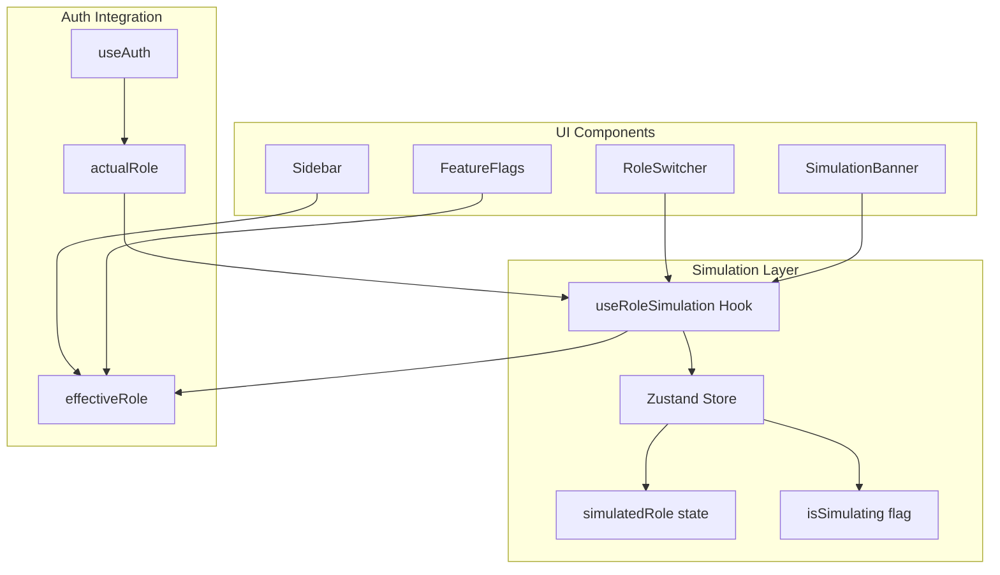

# Design Document: Admin Role Switching

## Overview

This feature adds a client-side role simulation capability for administrators. Admins can select a different role (Guest, Subscriber, Artist) to see how the UI appears for that role type. This is purely a frontend simulation - backend permissions remain unchanged.

## Steering Document Alignment

### Technical Standards
- React hooks for state management (`useRoleSimulation`)
- Zustand store for persistent session state
- DaisyUI components for UI elements
- TypeScript for type safety

### Project Structure
- New hook in `frontend/src/hooks/`
- New components in `frontend/src/components/admin/`
- Store in `frontend/src/lib/store/`

## Code Reuse Analysis

### Existing Components to Leverage
- **useAuth hook**: Extract actual user role, check `isAdmin`
- **useFeatureFlags hook**: Already handles role-based feature checks
- **Sidebar component**: Modify to respect simulated role
- **Header component**: Add role switcher dropdown

### Integration Points
- **Auth Context**: Simulation state wraps auth state
- **Feature Flags**: Override role input when simulating
- **Navigation**: Conditionally show/hide routes based on simulated role

---

## Architecture



### Modular Design Principles
- **Single File Responsibility**: `useRoleSimulation` handles only simulation logic
- **Component Isolation**: `RoleSwitcher` and `SimulationBanner` are standalone
- **Service Layer Separation**: Store manages state, hook provides interface
- **Utility Modularity**: Role permission checks remain in existing utilities

---

## Components and Interfaces

### Component 1: useRoleSimulation Hook
- **Purpose**: Manage role simulation state and provide effective role
- **Interfaces**:
  ```typescript
  interface UseRoleSimulation {
    // State
    isSimulating: boolean;
    simulatedRole: UserRole | null;
    effectiveRole: UserRole;

    // Actions
    startSimulation: (role: UserRole) => void;
    stopSimulation: () => void;

    // Utilities
    canSimulate: boolean; // true if user is admin
    isWriteBlocked: boolean; // true when simulating non-admin
  }
  ```
- **Dependencies**: `useAuth`, Zustand store
- **Reuses**: Existing `UserRole` type from `types/index.ts`

### Component 2: RoleSwitcher
- **Purpose**: Dropdown UI for selecting simulation role
- **Interfaces**:
  ```typescript
  interface RoleSwitcherProps {
    // No props - uses hook internally
  }
  ```
- **Dependencies**: `useRoleSimulation` hook
- **Reuses**: DaisyUI dropdown component

### Component 3: SimulationBanner
- **Purpose**: Persistent banner showing simulation status
- **Interfaces**:
  ```typescript
  interface SimulationBannerProps {
    // No props - uses hook internally
  }
  ```
- **Dependencies**: `useRoleSimulation` hook
- **Reuses**: DaisyUI alert component

### Component 4: roleSimulationStore (Zustand)
- **Purpose**: Persist simulation state across navigation
- **Interfaces**:
  ```typescript
  interface RoleSimulationState {
    simulatedRole: UserRole | null;
    setSimulatedRole: (role: UserRole | null) => void;
    clearSimulation: () => void;
  }
  ```
- **Dependencies**: Zustand
- **Reuses**: Existing store patterns from `lib/store/`

---

## Data Models

### SimulationState
```typescript
interface SimulationState {
  simulatedRole: UserRole | null;  // null = not simulating
  startedAt: number | null;        // timestamp for debugging
}
```

### RoleOption (for UI)
```typescript
interface RoleOption {
  value: UserRole;
  label: string;
  description: string;
  icon: string;
}

const ROLE_OPTIONS: RoleOption[] = [
  { value: 'admin', label: 'Admin', description: 'Full access (actual role)', icon: '👑' },
  { value: 'artist', label: 'Artist', description: 'Artist features enabled', icon: '🎨' },
  { value: 'subscriber', label: 'Subscriber', description: 'Standard user access', icon: '👤' },
  { value: 'guest', label: 'Guest', description: 'Unauthenticated view', icon: '👻' },
];
```

---

## UI Design

### Role Switcher Placement
- Located in Header, right side, before user avatar
- Only visible to admin users
- Dropdown with role options + descriptions

### Simulation Banner
- Fixed position at top of viewport (below header)
- Amber/orange background for visibility
- Contains: "Viewing as [Role]" text + "Exit" button
- Does not scroll with page

### Visual Mockup
```
┌─────────────────────────────────────────────────────────────┐
│ [Logo]  Search...            [🔄 Admin ▼] [Avatar]          │  ← Header
├─────────────────────────────────────────────────────────────┤
│ ⚠️ Viewing as Subscriber                      [Exit]        │  ← Banner (when simulating)
├─────────────────────────────────────────────────────────────┤
│ │ Home        │                                             │
│ │ Library     │  Main content area                          │
│ │ Playlists   │  (shows subscriber view)                    │
│ │ Upload      │                                             │
│ │ ─────────── │                                             │
│ │ [No Admin]  │  ← Admin section hidden when simulating     │
└─────────────────────────────────────────────────────────────┘
```

---

## Error Handling

### Error Scenarios

1. **Write action attempted in simulation mode**
   - **Handling**: Show toast "Action blocked in simulation mode"
   - **User Impact**: Action prevented, user informed

2. **Navigation to admin route while simulating**
   - **Handling**: Redirect to home, show toast
   - **User Impact**: Cannot access admin pages in simulation

3. **Session expires during simulation**
   - **Handling**: Clear simulation state on auth change
   - **User Impact**: Returns to login page normally

4. **Store corruption**
   - **Handling**: Default to non-simulating state
   - **User Impact**: Simulation ends, admin view restored

---

## Testing Strategy

### Unit Testing
- `useRoleSimulation` hook: test all state transitions
- `roleSimulationStore`: test persistence and clearing
- Role permission checks with simulation override

### Integration Testing
- Sidebar hides/shows items based on simulated role
- Feature flags respect simulated role
- Banner appears/disappears correctly

### End-to-End Testing
- Admin can switch to each role and back
- Navigation reflects simulated permissions
- Write actions are blocked appropriately
