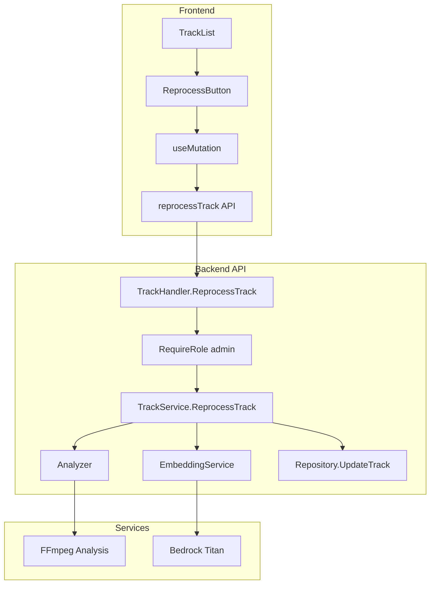

# Design Document: Admin Track Reprocess Button

## Overview

This feature adds admin-only functionality to re-trigger AI analysis on tracks. It includes a frontend button in the admin track view and a backend endpoint that orchestrates audio analysis (BPM, key detection) and embedding regeneration.

## Code Reuse Analysis

### Existing Components to Leverage

- **TrackService** (`backend/internal/service/track.go`): Extend with `ReprocessTrack` method following existing `GetTrack(ctx, userID, trackID, hasGlobal)` pattern
- **TrackList** (`frontend/src/components/library/TrackList.tsx`): Add button to existing actions column (already has download button pattern)
- **EmbeddingService** (`backend/internal/service/embedding.go`): Reuse `GenerateTrackEmbedding` for embedding regeneration
- **Analysis package** (`backend/internal/analysis/analyzer.go`): Reuse existing BPM/key analysis logic
- **getAuthContextWithDBRole** (`backend/internal/handlers/handlers.go`): Reuse for real-time admin role check
- **useMutation pattern** (`frontend/src/hooks/`): Follow existing mutation patterns with toast feedback

### Integration Points

- **Track model extension**: Add `ReprocessStatus`, `ReprocessedAt`, `ReprocessError` fields
- **DynamoDB**: Update track record with new analysis results
- **API routes**: Add `POST /tracks/:id/reprocess` route with admin middleware
- **TrackList component**: Add conditional button rendering for admins

## Architecture



### Modular Design Principles
- **Single File Responsibility**: New `ReprocessButton` component, extension to existing TrackService
- **Component Isolation**: Button component handles its own loading state
- **Service Layer Separation**: Handler validates, service orchestrates, analyzer/embedder do the work

## Components and Interfaces

### Component 1: ReprocessButton (Frontend)

**Purpose:** Render reprocess button with loading state for admin users

**Props:**
```typescript
interface ReprocessButtonProps {
  trackId: string;
  onSuccess?: () => void;
}
```

**Dependencies:** `useMutation`, `toast`, `reprocessTrack` API function
**Reuses:** Button styling from existing download button in TrackList

### Component 2: TrackHandler.ReprocessTrack (Backend)

**Purpose:** HTTP handler for reprocess endpoint

**Endpoint:** `POST /api/v1/tracks/:id/reprocess`

**Auth:** `RequireRole("admin")` middleware + `getAuthContextWithDBRole` real-time check

```go
func (h *Handlers) ReprocessTrack(c echo.Context) error {
    auth := h.getAuthContextWithDBRole(c)
    if !auth.HasGlobal {
        return handleError(c, models.ErrForbidden)
    }

    trackID := c.Param("id")
    result, err := h.services.Track.ReprocessTrack(c.Request().Context(), trackID)
    if err != nil {
        return handleError(c, err)
    }

    return c.JSON(http.StatusAccepted, result)
}
```

**Dependencies:** TrackService, auth helpers
**Reuses:** Existing handler patterns from `track.go`

### Component 3: TrackService.ReprocessTrack (Backend)

**Purpose:** Orchestrate AI reprocessing: audio analysis + embedding regeneration

**Interface:**
```go
func (s *TrackServiceImpl) ReprocessTrack(ctx context.Context, trackID string) (*models.ReprocessResult, error)
```

**Logic:**
1. Get track by ID (global access since admin-only)
2. Set `ReprocessStatus = "processing"`
3. Fetch audio file from S3
4. Run audio analyzer for BPM/key
5. Generate new embedding via EmbeddingService
6. Update track with results
7. Set `ReprocessStatus = "complete"` or "failed"

**Dependencies:** Repository, Analyzer, EmbeddingService, S3Repository
**Reuses:** `GenerateTrackEmbedding`, analyzer patterns

### Component 4: API Client Extension (Frontend)

**Purpose:** Add `reprocessTrack` function to API client

```typescript
// lib/api/tracks.ts
export async function reprocessTrack(trackId: string): Promise<ReprocessResult> {
  const response = await apiClient.post<ReprocessResult>(
    `/api/v1/tracks/${trackId}/reprocess`
  );
  return response.data;
}
```

## Data Models

### Track Model Extension (Backend)

```go
type Track struct {
    // ... existing fields

    // Reprocess tracking
    ReprocessStatus string    `json:"reprocessStatus,omitempty" dynamodbav:"ReprocessStatus,omitempty"`
    ReprocessedAt   *time.Time `json:"reprocessedAt,omitempty" dynamodbav:"ReprocessedAt,omitempty"`
    ReprocessError  string    `json:"reprocessError,omitempty" dynamodbav:"ReprocessError,omitempty"`
}

// Reprocess status values
const (
    ReprocessStatusPending    = "pending"
    ReprocessStatusProcessing = "processing"
    ReprocessStatusComplete   = "complete"
    ReprocessStatusFailed     = "failed"
)
```

### ReprocessResult (API Response)

```go
type ReprocessResult struct {
    TrackID         string    `json:"trackId"`
    Status          string    `json:"status"`
    BPM             float64   `json:"bpm,omitempty"`
    BPMConfidence   float64   `json:"bpmConfidence,omitempty"`
    MusicalKey      string    `json:"musicalKey,omitempty"`
    KeyCamelot      string    `json:"keyCamelot,omitempty"`
    EmbeddingStatus string    `json:"embeddingStatus,omitempty"`
    Error           string    `json:"error,omitempty"`
    ProcessedAt     time.Time `json:"processedAt,omitempty"`
}
```

### Frontend Type Extension

```typescript
// types/index.ts
export interface ReprocessResult {
  trackId: string;
  status: 'processing' | 'complete' | 'failed';
  bpm?: number;
  bpmConfidence?: number;
  musicalKey?: string;
  keyCamelot?: string;
  embeddingStatus?: string;
  error?: string;
  processedAt?: string;
}
```

## Error Handling

### Error Scenarios

1. **User Not Admin**
   - **Handling:** Return 403 Forbidden immediately
   - **User Impact:** "Access denied" error (should never see button anyway)

2. **Track Not Found**
   - **Handling:** Return 404 Not Found
   - **User Impact:** "Track not found" error toast

3. **Audio File Missing from S3**
   - **Handling:** Set ReprocessStatus="failed" with error details
   - **User Impact:** "Audio file not found" error toast

4. **Audio Analysis Failed**
   - **Handling:** Log error, continue to embedding (partial success OK)
   - **User Impact:** Success with warning that some analysis failed

5. **Embedding Generation Failed**
   - **Handling:** Log error, save any successful analysis results
   - **User Impact:** Success with warning that embedding failed

6. **Rate Limited**
   - **Handling:** Return 429 Too Many Requests
   - **User Impact:** "Please wait before reprocessing more tracks"

## Testing Strategy

### Unit Testing

**Backend:**
- `TrackService.ReprocessTrack`: Mock analyzer, embedder, repo
  - Test successful full reprocess
  - Test partial success (analysis succeeds, embedding fails)
  - Test track not found
  - Test audio file missing
- `TrackHandler.ReprocessTrack`: Mock service
  - Test admin access granted
  - Test non-admin rejected (403)
  - Test track not found (404)

**Frontend:**
- `ReprocessButton`: Mock useMutation
  - Test button renders for admin
  - Test loading state during mutation
  - Test success toast on completion
  - Test error toast on failure
- `TrackList` with reprocess:
  - Test button visible when admin + showUploadedBy
  - Test button hidden for non-admin

### Integration Testing

**Backend:**
- Test full reprocess flow with LocalStack S3 + DynamoDB
- Test auth middleware rejects non-admin

### End-to-End Testing

- Admin logs in
- Views track list with admin column visible
- Clicks reprocess button
- Sees loading state
- Sees success toast
- Track data refreshes with new BPM/key

## API Specifications

### POST /api/v1/tracks/:id/reprocess

**Auth:** Admin only (real-time DB role check)

**Request:** No body required

**Response (202 Accepted):**
```json
{
  "trackId": "track-123",
  "status": "processing",
  "processedAt": "2026-02-17T10:30:00Z"
}
```

**Response (200 OK - if synchronous):**
```json
{
  "trackId": "track-123",
  "status": "complete",
  "bpm": 128.5,
  "bpmConfidence": 0.92,
  "musicalKey": "G minor",
  "keyCamelot": "6A",
  "embeddingStatus": "updated",
  "processedAt": "2026-02-17T10:30:05Z"
}
```

**Error Responses:**
- 403 Forbidden: User is not admin
- 404 Not Found: Track does not exist
- 429 Too Many Requests: Rate limited
- 500 Internal Server Error: Unexpected error

## File Locations

| Component | File Path |
|-----------|-----------|
| Handler | `backend/internal/handlers/track.go` (extend) |
| Service method | `backend/internal/service/track.go` (extend) |
| Model extension | `backend/internal/models/track.go` (extend) |
| Route registration | `backend/internal/handlers/handlers.go` (extend) |
| ReprocessButton | `frontend/src/components/library/ReprocessButton.tsx` (new) |
| TrackList update | `frontend/src/components/library/TrackList.tsx` (extend) |
| API client | `frontend/src/lib/api/tracks.ts` (extend) |
| Types | `frontend/src/types/index.ts` (extend) |
