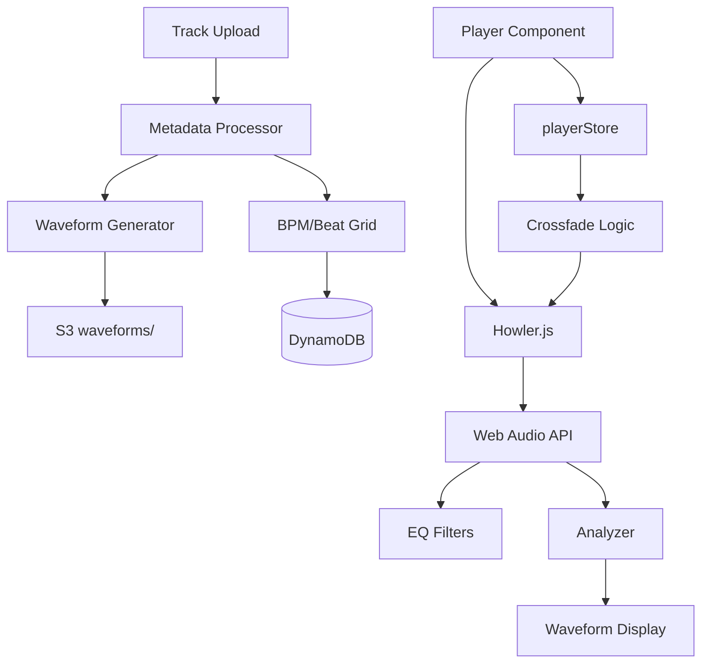

# Design Document: Audio Analysis & Player Enhancements

## Overview

This design adds professional-grade audio player features: waveform visualization, beat grid display, gapless playback, crossfade, equalizer, and playback speed control. The implementation extends the existing Howler.js-based player with Web Audio API for advanced features.

## Steering Document Alignment

### Technical Standards
- React 18 with TypeScript
- Zustand for state management
- Howler.js for audio playback
- Web Audio API for EQ and analysis

### Project Structure
- Components: `frontend/src/components/player/`
- Hooks: `frontend/src/hooks/useAudio*.ts`
- Store: `frontend/src/lib/store/playerStore.ts`
- Backend: `backend/cmd/processor/` for waveform generation

## Code Reuse Analysis

### Existing Components to Leverage
- **PlayerBar.tsx**: Extend with waveform, EQ controls
- **playerStore.ts**: Add waveform, EQ, crossfade state
- **usePlayerStore**: Extend with new actions
- **processor/metadata**: Add waveform generation

### Integration Points
- **S3 Storage**: Store waveform JSON files
- **DynamoDB**: Store waveform URL, beat grid in track metadata
- **CloudFront**: Serve waveform data with signed URLs

## Architecture



### Modular Design Principles
- **Single File Responsibility**: Waveform.tsx, Equalizer.tsx, CrossfadeManager.ts
- **Component Isolation**: Each audio feature is a separate component/hook
- **Service Layer Separation**: Audio processing in hooks, UI in components
- **Utility Modularity**: Audio analysis utilities separate from player logic

## Components and Interfaces

### Waveform Component
- **Purpose:** Display audio waveform with playback progress
- **Interfaces:**
  ```typescript
  interface WaveformProps {
    trackId: string;
    waveformUrl?: string;
    progress: number;
    duration: number;
    beatGrid?: number[];
    onSeek: (time: number) => void;
  }
  ```
- **Dependencies:** Canvas/SVG rendering, waveform data
- **Reuses:** Progress bar patterns from existing player

### Equalizer Component
- **Purpose:** 3-band EQ with presets
- **Interfaces:**
  ```typescript
  interface EqualizerProps {
    low: number;    // -12 to +12 dB
    mid: number;
    high: number;
    preset?: EQPreset;
    onChange: (band: 'low' | 'mid' | 'high', value: number) => void;
    onPresetChange: (preset: EQPreset) => void;
  }
  ```
- **Dependencies:** Web Audio API
- **Reuses:** Slider components from existing UI

### useAudioProcessor Hook
- **Purpose:** Manage Web Audio API processing chain
- **Interfaces:**
  ```typescript
  interface UseAudioProcessor {
    audioContext: AudioContext | null;
    connectSource: (source: AudioNode) => void;
    setEQ: (low: number, mid: number, high: number) => void;
    setPlaybackRate: (rate: number) => void;
    getAnalyzerData: () => Uint8Array;
  }
  ```
- **Dependencies:** Web Audio API

### CrossfadeManager
- **Purpose:** Handle crossfade between tracks
- **Interfaces:**
  ```typescript
  interface CrossfadeManager {
    startCrossfade: (fromHowl: Howl, toHowl: Howl, duration: number) => void;
    cancelCrossfade: () => void;
    isActive: boolean;
  }
  ```
- **Dependencies:** Howler.js

## Data Models

### WaveformData
```typescript
interface WaveformData {
  trackId: string;
  peaks: number[];      // Normalized 0-1 values
  sampleRate: number;   // Samples per second (100)
  duration: number;     // Track duration in seconds
  version: number;      // Data format version
}
```

### BeatGrid
```typescript
interface BeatGrid {
  bpm: number;
  offset: number;       // First beat offset in ms
  beats: number[];      // Beat timestamps in ms
  downbeats: number[];  // Downbeat indices (every 4th)
  isVariable: boolean;  // True if BPM varies
}
```

### EQSettings
```typescript
interface EQSettings {
  low: number;   // -12 to +12 dB
  mid: number;
  high: number;
  preset: EQPreset | null;
}

type EQPreset = 'flat' | 'bass_boost' | 'vocal' | 'electronic' | 'acoustic';
```

### Extended Player State
```typescript
interface PlayerState {
  // Existing fields...
  currentTrack: Track | null;
  isPlaying: boolean;
  volume: number;
  progress: number;

  // New fields
  waveformData: WaveformData | null;
  beatGrid: BeatGrid | null;
  eq: EQSettings;
  crossfade: {
    enabled: boolean;
    duration: number; // 0, 1, 3, 5, 10 seconds
  };
  playbackSpeed: number; // 0.5, 0.75, 1, 1.25, 1.5, 2
  gapless: boolean;

  // New actions
  setEQ: (settings: Partial<EQSettings>) => void;
  setCrossfade: (enabled: boolean, duration?: number) => void;
  setPlaybackSpeed: (speed: number) => void;
  setGapless: (enabled: boolean) => void;
}
```

## Backend Waveform Generation

### Processor Enhancement
```go
// In backend/cmd/processor/metadata/main.go
type WaveformResult struct {
    Peaks      []float64 `json:"peaks"`
    SampleRate int       `json:"sampleRate"`
    Duration   float64   `json:"duration"`
}

func GenerateWaveform(audioPath string) (*WaveformResult, error) {
    // Use FFmpeg to extract waveform data
    // ffmpeg -i input.mp3 -filter_complex "aformat=channel_layouts=mono,showwavespic=s=1000x1:colors=#000000" -frames:v 1 -f rawvideo -
    // Parse output to get peak values
}
```

### S3 Storage Structure
```
s3://music-library-media/
├── tracks/{userId}/{trackId}/
│   ├── original.mp3
│   ├── transcoded.m4a
│   └── waveform.json
```

## Error Handling

### Error Scenarios
1. **Waveform Data Unavailable**
   - **Handling:** Show progress bar fallback
   - **User Impact:** Standard player experience, no waveform

2. **Web Audio API Unsupported**
   - **Handling:** Hide EQ, show "EQ not supported" toast
   - **User Impact:** Basic playback without EQ

3. **Crossfade Preload Failure**
   - **Handling:** Fall back to standard transition
   - **User Impact:** Brief pause between tracks

4. **Beat Grid Calculation Error**
   - **Handling:** Show "Variable BPM" indicator
   - **User Impact:** No beat markers on waveform

## Testing Strategy

### Unit Testing
- Waveform rendering with mock data
- EQ calculations and filter application
- Crossfade timing logic
- Player store state transitions

### Integration Testing
- Waveform fetch → render → seek interaction
- EQ settings persistence across sessions
- Crossfade with real audio files
- Gapless playback verification

### End-to-End Testing
- Upload track → Generate waveform → Display in player
- EQ preset selection → Audio output verification
- Crossfade between tracks in playlist
- Mobile touch interaction for waveform seek
