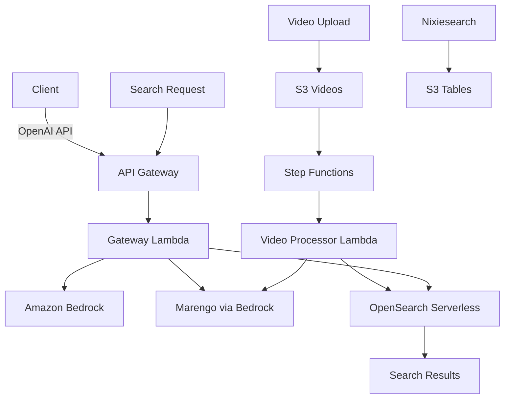

# Design Document: Bedrock Access Gateway + Marengo Integration

## Overview

This design deploys the AWS Bedrock Access Gateway with extended support for TwelveLabs Marengo video embedding models. The architecture uses API Gateway + Lambda for cost-effective deployment, with OpenSearch Serverless for vector storage and S3 Tables for optimized Nixiesearch indexing.

## Steering Document Alignment

### Technical Standards
- Go 1.22+ for Lambda functions
- OpenTofu for infrastructure
- AWS Lambda with API Gateway
- OpenSearch Serverless for vector storage

### Project Structure
- Gateway Lambda: `backend/cmd/gateway/`
- Video Processor: `backend/cmd/processor/video/`
- Infrastructure: `infrastructure/backend/bedrock-gateway.tf`
- Vector Store: `infrastructure/backend/opensearch.tf`

## Code Reuse Analysis

### Existing Components to Leverage
- **cmd/api/main.go**: Lambda handler patterns
- **internal/repository/s3.go**: S3 operations for video storage
- **internal/service/stream.go**: Signed URL generation patterns
- **infrastructure/backend/**: Existing Terraform patterns

### Integration Points
- **S3 Media Bucket**: Store uploaded videos
- **Step Functions**: Orchestrate video processing pipeline
- **Nixiesearch**: Integrate with S3 Tables for improved indexing
- **CloudFront**: Serve video content with signed URLs

## Architecture



### Modular Design Principles
- **Single File Responsibility**: Gateway handler, Marengo client, Vector store client separate
- **Component Isolation**: Video processing independent of gateway
- **Service Layer Separation**: Gateway routes, Bedrock client, Vector operations
- **Utility Modularity**: Shared auth, logging, error handling

## Components and Interfaces

### Gateway Handler
- **Purpose:** OpenAI-compatible API routing to Bedrock
- **Interfaces:**
  ```go
  type GatewayHandler interface {
      HandleChatCompletion(c echo.Context) error
      HandleEmbeddings(c echo.Context) error
      HandleVideoEmbeddings(c echo.Context) error
      HandleModels(c echo.Context) error
  }
  ```
- **Dependencies:** Bedrock client, Marengo client
- **Reuses:** Echo handler patterns from existing API

### Bedrock Client
- **Purpose:** Invoke Bedrock models with OpenAI request translation
- **Interfaces:**
  ```go
  type BedrockClient interface {
      InvokeModel(ctx context.Context, req ModelRequest) (*ModelResponse, error)
      InvokeModelStream(ctx context.Context, req ModelRequest) (<-chan StreamChunk, error)
      ListModels(ctx context.Context) ([]ModelInfo, error)
  }
  ```
- **Dependencies:** AWS SDK Bedrock Runtime

### Marengo Client
- **Purpose:** Generate video embeddings via Bedrock Marengo
- **Interfaces:**
  ```go
  type MarengoClient interface {
      GenerateEmbedding(ctx context.Context, videoURI string, opts EmbeddingOptions) (*VideoEmbedding, error)
      GetJobStatus(ctx context.Context, jobID string) (*JobStatus, error)
  }
  ```
- **Dependencies:** AWS SDK Bedrock, S3

### Vector Store
- **Purpose:** Store and query video embeddings
- **Interfaces:**
  ```go
  type VectorStore interface {
      IndexVideo(ctx context.Context, videoID string, embedding []float32, metadata map[string]interface{}) error
      SearchSimilar(ctx context.Context, query []float32, k int, filters map[string]interface{}) ([]SearchResult, error)
      DeleteVideo(ctx context.Context, videoID string) error
  }
  ```
- **Dependencies:** OpenSearch client

### Video Processor
- **Purpose:** Process uploaded videos through Marengo pipeline
- **Interfaces:**
  ```go
  type VideoProcessor interface {
      ProcessVideo(ctx context.Context, input ProcessVideoInput) (*ProcessResult, error)
      GetProcessingStatus(ctx context.Context, videoID string) (*ProcessingStatus, error)
  }
  ```
- **Dependencies:** MarengoClient, VectorStore, S3

## Data Models

### VideoEmbedding
```go
type VideoEmbedding struct {
    VideoID     string    `json:"videoId"`
    UserID      string    `json:"userId"`
    Embedding   []float32 `json:"embedding"` // 1024 dimensions
    EmbedType   string    `json:"embedType"` // visual, audio, speech, combined
    Duration    int       `json:"duration"`  // seconds
    CreatedAt   time.Time `json:"createdAt"`
}
```

### VideoMetadata
```go
type VideoMetadata struct {
    ID          string            `json:"id"`
    UserID      string            `json:"userId"`
    Title       string            `json:"title"`
    Description string            `json:"description,omitempty"`
    S3Key       string            `json:"s3Key"`
    Duration    int               `json:"duration"`
    Format      string            `json:"format"`
    Status      string            `json:"status"` // pending, processing, indexed, failed
    Error       string            `json:"error,omitempty"`
    Tags        map[string]string `json:"tags,omitempty"`
    CreatedAt   time.Time         `json:"createdAt"`
    UpdatedAt   time.Time         `json:"updatedAt"`
}

// DynamoDB Keys: PK=USER#{userId}, SK=VIDEO#{videoId}
```

### SearchResult
```go
type SearchResult struct {
    VideoID    string                 `json:"videoId"`
    Score      float32                `json:"score"`
    Metadata   map[string]interface{} `json:"metadata"`
    Timestamp  *int                   `json:"timestamp,omitempty"` // for temporal search
}
```

### OpenSearch Index Mapping
```json
{
  "mappings": {
    "properties": {
      "videoId": { "type": "keyword" },
      "userId": { "type": "keyword" },
      "embedding": {
        "type": "knn_vector",
        "dimension": 1024,
        "method": {
          "name": "hnsw",
          "space_type": "cosinesimil",
          "engine": "nmslib",
          "parameters": {
            "ef_construction": 256,
            "m": 16
          }
        }
      },
      "title": { "type": "text" },
      "duration": { "type": "integer" },
      "createdAt": { "type": "date" }
    }
  }
}
```

## API Endpoints

### Gateway Endpoints (OpenAI-compatible)
| Method | Path | Description |
|--------|------|-------------|
| POST | `/v1/chat/completions` | Chat completion (Claude, Nova) |
| POST | `/v1/embeddings` | Text embeddings |
| POST | `/v1/embeddings/video` | Video embeddings (Marengo) |
| GET | `/v1/models` | List available models |

### Video Search API
| Method | Path | Description |
|--------|------|-------------|
| POST | `/api/v1/videos` | Upload video metadata |
| GET | `/api/v1/videos` | List user's videos |
| GET | `/api/v1/videos/:id` | Get video details |
| DELETE | `/api/v1/videos/:id` | Delete video |
| POST | `/api/v1/search/videos` | Text-to-video search |
| POST | `/api/v1/search/videos/by-audio` | Audio-to-video search |
| POST | `/api/v1/search/videos/by-image` | Image-to-video search |

## S3 Tables Integration

### Table Schema (Apache Iceberg)
```sql
CREATE TABLE nixiesearch_index (
    id STRING,
    user_id STRING,
    entity_type STRING,
    content STRUCT<title: STRING, artist: STRING, album: STRING, tags: ARRAY<STRING>>,
    embedding ARRAY<FLOAT>,
    created_at TIMESTAMP,
    updated_at TIMESTAMP
)
PARTITIONED BY (user_id, days(created_at))
LOCATION 's3://music-library-index/nixiesearch/'
TBLPROPERTIES ('table_type' = 'ICEBERG');
```

### Query Integration
- Athena for complex aggregations
- Direct S3 Select for simple queries
- Nixiesearch for full-text search with S3 Tables backend

## Error Handling

### Error Scenarios
1. **Video Too Long**
   - **Handling:** Return 400 with max duration message
   - **User Impact:** "Video exceeds 4-hour maximum duration"

2. **Marengo Processing Failure**
   - **Handling:** Retry 3x, mark as failed, store error
   - **User Impact:** Status shows "failed" with error details

3. **Vector Store Unavailable**
   - **Handling:** Queue for retry, return 503
   - **User Impact:** "Search temporarily unavailable"

4. **Invalid Model Request**
   - **Handling:** Return 400 with available models
   - **User Impact:** List of supported models

## Testing Strategy

### Unit Testing
- Gateway request/response translation
- Marengo client with mocked Bedrock
- Vector store operations with mocked OpenSearch

### Integration Testing
- End-to-end video upload → embedding → search
- Gateway with real Bedrock (non-Marengo models for cost)
- S3 Tables query performance

### End-to-End Testing
- Upload video → Process → Search by text
- Cross-modal search (audio-to-video)
- Multi-user isolation verification
