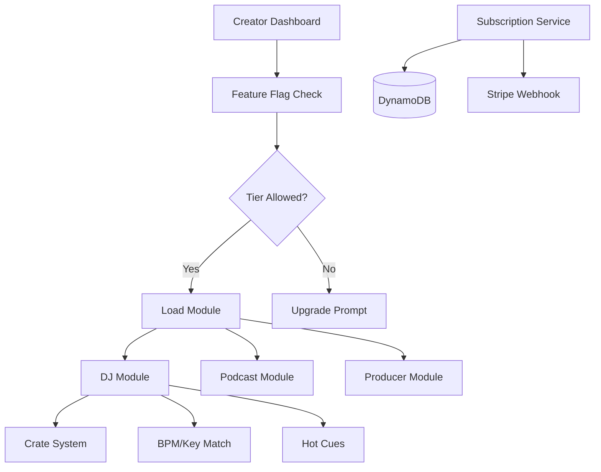

# Design Document: Creator Studio Foundation

## Overview

This design establishes the Creator Studio foundation: feature flag system, subscription tiers, creator dashboard, and the first creator module (DJ Studio with crates, BPM/key matching, and hot cues). This builds on the Artist Entity from WS1 for creator profile linking.

## Steering Document Alignment

### Technical Standards
- Go 1.22+ for backend services
- React 18 with TypeScript for frontend
- DynamoDB for feature flags and subscriptions
- Zustand for creator studio state

### Project Structure
- Backend: `backend/internal/service/feature/`, `backend/internal/service/subscription/`
- Frontend: `frontend/src/components/studio/`, `frontend/src/routes/studio/`
- Infrastructure: `infrastructure/backend/feature-flags.tf`

## Code Reuse Analysis

### Existing Components to Leverage
- **Artist Entity (WS1)**: Link creator profile to Artist
- **playerStore.ts**: Extend for hot cues
- **Track types**: Extend with crate membership
- **useAuth hook**: Extend with subscription tier

### Integration Points
- **Cognito**: Store subscription tier in user attributes
- **DynamoDB**: Feature flags table, crates, hot cues
- **Stripe**: Payment processing for subscriptions

## Architecture



### Modular Design Principles
- **Single File Responsibility**: FeatureFlagService, SubscriptionService, CrateService separate
- **Component Isolation**: Each creator module loads independently
- **Service Layer Separation**: Feature checks in middleware, module logic in services
- **Utility Modularity**: Shared Camelot wheel utilities, BPM matching

## Components and Interfaces

### Feature Flag Service (Backend)
- **Purpose:** Manage feature flags per tier/user
- **Interfaces:**
  ```go
  type FeatureFlagService interface {
      IsEnabled(ctx context.Context, userID, featureKey string) (bool, error)
      GetEnabledFeatures(ctx context.Context, userID string) ([]string, error)
      SetUserOverride(ctx context.Context, userID, featureKey string, enabled bool) error
  }
  ```
- **Dependencies:** DynamoDB, SubscriptionService

### Subscription Service (Backend)
- **Purpose:** Manage user subscriptions and tiers
- **Interfaces:**
  ```go
  type SubscriptionService interface {
      GetTier(ctx context.Context, userID string) (Tier, error)
      UpdateTier(ctx context.Context, userID string, tier Tier) error
      GetStorageUsed(ctx context.Context, userID string) (int64, error)
      GetStorageLimit(ctx context.Context, userID string) (int64, error)
      ProcessWebhook(ctx context.Context, event StripeEvent) error
  }
  ```
- **Dependencies:** DynamoDB, Stripe SDK

### Crate Service (Backend)
- **Purpose:** DJ crate CRUD operations
- **Interfaces:**
  ```go
  type CrateService interface {
      CreateCrate(ctx context.Context, userID string, input CreateCrateInput) (*Crate, error)
      ListCrates(ctx context.Context, userID string) ([]*Crate, error)
      GetCrate(ctx context.Context, userID, crateID string) (*CrateWithTracks, error)
      UpdateCrate(ctx context.Context, userID, crateID string, input UpdateCrateInput) (*Crate, error)
      DeleteCrate(ctx context.Context, userID, crateID string) error
      AddTrackToCrate(ctx context.Context, userID, crateID, trackID string) error
      RemoveTrackFromCrate(ctx context.Context, userID, crateID, trackID string) error
  }
  ```
- **Dependencies:** DynamoDB

### Hot Cue Service (Backend)
- **Purpose:** Manage per-track hot cue points
- **Interfaces:**
  ```go
  type HotCueService interface {
      SetHotCue(ctx context.Context, userID, trackID string, slot int, cue HotCue) error
      GetHotCues(ctx context.Context, userID, trackID string) ([]HotCue, error)
      DeleteHotCue(ctx context.Context, userID, trackID string, slot int) error
  }
  ```
- **Dependencies:** DynamoDB

### useFeatureFlags Hook (Frontend)
- **Purpose:** Check feature availability in components
- **Interfaces:**
  ```typescript
  interface UseFeatureFlags {
      isEnabled: (featureKey: string) => boolean;
      tier: Tier;
      features: string[];
      isLoading: boolean;
  }
  ```

### Creator Dashboard Component
- **Purpose:** Main creator studio interface
- **Interfaces:**
  ```typescript
  interface CreatorDashboardProps {
      // No props - uses context/hooks for data
  }
  ```
- **Dependencies:** useFeatureFlags, useCreatorProfile, useAnalytics

## Data Models

### FeatureFlag
```go
type FeatureFlag struct {
    Key         string   `dynamodbav:"key" json:"key"`
    Name        string   `dynamodbav:"name" json:"name"`
    Description string   `dynamodbav:"description" json:"description"`
    EnabledTiers []Tier  `dynamodbav:"enabledTiers" json:"enabledTiers"`
    EnabledUsers []string `dynamodbav:"enabledUsers,omitempty" json:"enabledUsers,omitempty"`
    IsGlobal    bool     `dynamodbav:"isGlobal" json:"isGlobal"`
}

// DynamoDB Keys: PK=FEATURE, SK=FLAG#{key}
```

### Tier
```go
type Tier string

const (
    TierFree    Tier = "free"
    TierCreator Tier = "creator"
    TierPro     Tier = "pro"
    TierStudio  Tier = "studio"
)

type TierConfig struct {
    Name         string `json:"name"`
    PriceMonthly int    `json:"priceMonthly"` // cents
    StorageGB    int    `json:"storageGB"`    // -1 for unlimited
    Modules      []string `json:"modules"`
}
```

### Crate
```go
type Crate struct {
    ID        string    `dynamodbav:"id" json:"id"`
    UserID    string    `dynamodbav:"userId" json:"userId"`
    Name      string    `dynamodbav:"name" json:"name"`
    Color     string    `dynamodbav:"color,omitempty" json:"color,omitempty"`
    Icon      string    `dynamodbav:"icon,omitempty" json:"icon,omitempty"`
    TrackIDs  []string  `dynamodbav:"trackIds" json:"trackIds"`
    SortOrder []string  `dynamodbav:"sortOrder,omitempty" json:"sortOrder,omitempty"`
    CreatedAt time.Time `dynamodbav:"createdAt" json:"createdAt"`
    UpdatedAt time.Time `dynamodbav:"updatedAt" json:"updatedAt"`
}

// DynamoDB Keys: PK=USER#{userId}, SK=CRATE#{crateId}
```

### HotCue
```go
type HotCue struct {
    Slot      int       `dynamodbav:"slot" json:"slot"`       // 1-8
    Timestamp int       `dynamodbav:"timestamp" json:"timestamp"` // milliseconds
    Color     string    `dynamodbav:"color,omitempty" json:"color,omitempty"`
    Label     string    `dynamodbav:"label,omitempty" json:"label,omitempty"`
}

// Stored in Track item: hotCues: []HotCue
```

### BPM/Key Matching
```typescript
interface CompatibleTrack {
    track: Track;
    bpmDiff: number;      // Percentage difference
    keyCompatibility: 'same' | 'neighbor' | 'relative' | 'none';
    score: number;        // Combined compatibility 0-100
}

// Camelot Wheel neighbors
const CAMELOT_NEIGHBORS: Record<string, string[]> = {
    '1A': ['12A', '2A', '1B'],
    '1B': ['12B', '2B', '1A'],
    // ... etc for all 24 keys
};
```

## API Endpoints

### Feature Flags
| Method | Path | Description |
|--------|------|-------------|
| GET | `/api/v1/features` | Get enabled features for user |
| GET | `/api/v1/features/:key` | Check specific feature |

### Subscription
| Method | Path | Description |
|--------|------|-------------|
| GET | `/api/v1/subscription` | Get current subscription |
| POST | `/api/v1/subscription/checkout` | Create Stripe checkout session |
| POST | `/api/v1/subscription/portal` | Get Stripe customer portal URL |
| POST | `/api/v1/webhooks/stripe` | Stripe webhook handler |

### DJ Studio - Crates
| Method | Path | Description |
|--------|------|-------------|
| GET | `/api/v1/studio/crates` | List crates |
| POST | `/api/v1/studio/crates` | Create crate |
| GET | `/api/v1/studio/crates/:id` | Get crate with tracks |
| PUT | `/api/v1/studio/crates/:id` | Update crate |
| DELETE | `/api/v1/studio/crates/:id` | Delete crate |
| POST | `/api/v1/studio/crates/:id/tracks` | Add tracks to crate |
| DELETE | `/api/v1/studio/crates/:id/tracks/:trackId` | Remove track |

### DJ Studio - Hot Cues
| Method | Path | Description |
|--------|------|-------------|
| GET | `/api/v1/tracks/:id/hotcues` | Get hot cues for track |
| PUT | `/api/v1/tracks/:id/hotcues/:slot` | Set hot cue |
| DELETE | `/api/v1/tracks/:id/hotcues/:slot` | Delete hot cue |

### DJ Studio - Matching
| Method | Path | Description |
|--------|------|-------------|
| GET | `/api/v1/studio/match` | Find compatible tracks |

## Error Handling

### Error Scenarios
1. **Feature Not Enabled**
   - **Handling:** Return 403 with upgrade prompt info
   - **User Impact:** See upgrade CTA with feature preview

2. **Storage Limit Exceeded**
   - **Handling:** Block upload, return 413 with limit info
   - **User Impact:** "Storage limit reached. Upgrade to continue."

3. **Stripe Webhook Failure**
   - **Handling:** Return 200 (Stripe retries), log error
   - **User Impact:** Tier update may be delayed

4. **Crate Track Limit**
   - **Handling:** Limit to 1000 tracks per crate
   - **User Impact:** "Crate limit reached. Create a new crate."

## Testing Strategy

### Unit Testing
- Feature flag evaluation logic
- BPM/key compatibility calculation
- Crate CRUD operations
- Subscription tier transitions

### Integration Testing
- Stripe checkout → webhook → tier update
- Feature flag → API middleware → blocked request
- Crate with tracks → search within crate

### End-to-End Testing
- Free user upgrade to Creator → Access DJ module
- Create crate → Add tracks → Search in crate
- Set hot cue → Play track → Recall hot cue
