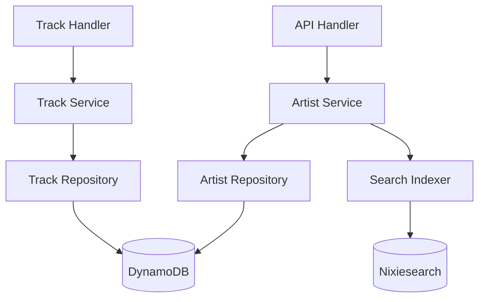

# Design Document: Data Model Foundation

## Overview

This design establishes a proper Artist entity model with UUIDs to replace string-based artist references in tracks. The implementation uses DynamoDB single-table design, extends the existing repository pattern, and includes a migration strategy for existing data.

## Steering Document Alignment

### Technical Standards
- Go 1.22+ with Echo v4 framework
- DynamoDB single-table design pattern
- UUID generation via google/uuid
- Repository pattern for data access

### Project Structure
- Models: `backend/internal/models/artist.go`
- Repository: `backend/internal/repository/artist.go`
- Service: `backend/internal/service/artist.go`
- Handlers: `backend/internal/handlers/artist.go`

## Code Reuse Analysis

### Existing Components to Leverage
- **models/track.go**: Extend Track model with artistId field
- **repository/dynamodb.go**: Base DynamoDB client and query patterns
- **handlers/handlers.go**: Handler registration and helper functions
- **service/track.go**: Pattern for service layer implementation

### Integration Points
- **DynamoDB MusicLibrary table**: Add ARTIST entity type
- **Nixiesearch**: Index artist data for search
- **Frontend Track types**: Update to include artistId

## Architecture



### Modular Design Principles
- **Single File Responsibility**: Artist CRUD in artist.go files, migration in migration.go
- **Component Isolation**: Artist service independent of Track service
- **Service Layer Separation**: Repository handles DynamoDB, Service handles business logic
- **Utility Modularity**: Shared UUID generation, validation utilities

## Components and Interfaces

### Artist Repository
- **Purpose:** CRUD operations for Artist entities in DynamoDB
- **Interfaces:**
  ```go
  type ArtistRepository interface {
      Create(ctx context.Context, artist *Artist) error
      GetByID(ctx context.Context, userID, artistID string) (*Artist, error)
      GetByName(ctx context.Context, userID, name string) ([]*Artist, error)
      List(ctx context.Context, userID string, opts ListOptions) (*PaginatedResult[Artist], error)
      Update(ctx context.Context, artist *Artist) error
      Delete(ctx context.Context, userID, artistID string) error
  }
  ```
- **Dependencies:** AWS SDK DynamoDB client
- **Reuses:** Base repository patterns from dynamodb.go

### Artist Service
- **Purpose:** Business logic for artist management
- **Interfaces:**
  ```go
  type ArtistService interface {
      CreateArtist(ctx context.Context, userID string, input CreateArtistInput) (*Artist, error)
      GetArtist(ctx context.Context, userID, artistID string) (*ArtistWithStats, error)
      ListArtists(ctx context.Context, userID string, opts ListOptions) (*PaginatedResult[Artist], error)
      UpdateArtist(ctx context.Context, userID, artistID string, input UpdateArtistInput) (*Artist, error)
      DeleteArtist(ctx context.Context, userID, artistID string) error
      SearchArtists(ctx context.Context, userID, query string) ([]*Artist, error)
  }
  ```
- **Dependencies:** ArtistRepository, TrackRepository (for stats)
- **Reuses:** Service patterns from track.go

### Migration Service
- **Purpose:** Migrate existing string-based artists to entity model
- **Interfaces:**
  ```go
  type MigrationService interface {
      MigrateArtists(ctx context.Context, userID string) (*MigrationResult, error)
      GetMigrationStatus(ctx context.Context, userID string) (*MigrationStatus, error)
  }
  ```
- **Dependencies:** ArtistRepository, TrackRepository

## Data Models

### Artist
```go
type Artist struct {
    ID           string            `dynamodbav:"id" json:"id"`
    UserID       string            `dynamodbav:"userId" json:"userId"`
    Name         string            `dynamodbav:"name" json:"name"`
    SortName     string            `dynamodbav:"sortName" json:"sortName"`
    Bio          string            `dynamodbav:"bio,omitempty" json:"bio,omitempty"`
    ImageURL     string            `dynamodbav:"imageUrl,omitempty" json:"imageUrl,omitempty"`
    ExternalLinks map[string]string `dynamodbav:"externalLinks,omitempty" json:"externalLinks,omitempty"`
    IsActive     bool              `dynamodbav:"isActive" json:"isActive"`
    CreatedAt    time.Time         `dynamodbav:"createdAt" json:"createdAt"`
    UpdatedAt    time.Time         `dynamodbav:"updatedAt" json:"updatedAt"`
}

// DynamoDB Keys: PK=USER#{userId}, SK=ARTIST#{artistId}
// GSI1: PK=USER#{userId}#ARTIST, SK=name (for name lookups)
```

### ArtistContribution
```go
type ArtistContribution struct {
    ArtistID string `dynamodbav:"artistId" json:"artistId"`
    Role     string `dynamodbav:"role" json:"role"` // main, featuring, remixer, producer
}

// Roles enum
const (
    RoleMain      = "main"
    RoleFeaturing = "featuring"
    RoleRemixer   = "remixer"
    RoleProducer  = "producer"
)
```

### Updated Track Model
```go
type Track struct {
    // ... existing fields ...
    ArtistID      string               `dynamodbav:"artistId" json:"artistId"`
    Artists       []ArtistContribution `dynamodbav:"artists,omitempty" json:"artists,omitempty"`
    ArtistLegacy  string               `dynamodbav:"artistLegacy,omitempty" json:"-"` // backup during migration
}
```

### ArtistWithStats
```go
type ArtistWithStats struct {
    Artist
    TrackCount int `json:"trackCount"`
    AlbumCount int `json:"albumCount"`
    TotalPlays int `json:"totalPlays"`
}
```

## API Endpoints

| Method | Path | Handler | Description |
|--------|------|---------|-------------|
| POST | `/api/v1/artists` | CreateArtist | Create new artist |
| GET | `/api/v1/artists` | ListArtists | List user's artists |
| GET | `/api/v1/artists/:id` | GetArtist | Get artist with stats |
| PUT | `/api/v1/artists/:id` | UpdateArtist | Update artist metadata |
| DELETE | `/api/v1/artists/:id` | DeleteArtist | Soft-delete artist |
| GET | `/api/v1/artists/:id/tracks` | GetArtistTracks | Get tracks by artist |
| POST | `/api/v1/migrate/artists` | MigrateArtists | Run artist migration |

## Error Handling

### Error Scenarios
1. **Artist Not Found**
   - **Handling:** Return 404 with ArtistNotFound error code
   - **User Impact:** "Artist not found" message

2. **Duplicate Artist Name (Warning only)**
   - **Handling:** Allow creation, return warning in response
   - **User Impact:** "Note: An artist with this name already exists"

3. **Migration Conflict**
   - **Handling:** Retry with exponential backoff, log conflicts
   - **User Impact:** Background operation, status shows "partial" with details

4. **Invalid External Link**
   - **Handling:** Validate URL format, return 400 for invalid
   - **User Impact:** "Invalid URL format for [platform]"

## Testing Strategy

### Unit Testing
- Artist model validation (name required, valid URLs)
- Service logic (create, update with business rules)
- Repository mock tests

### Integration Testing
- DynamoDB operations with local DynamoDB
- Migration end-to-end with test data
- API endpoint tests with mocked auth

### End-to-End Testing
- Create artist → Create track with artist → View artist profile
- Migration flow with existing tracks
- Multi-artist track creation and display
