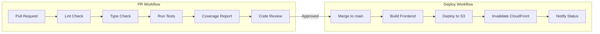

# Design Document - Distribution & Polish (Epic 6)

## Overview

This design covers three main deliverables for Epic 6:
1. **Frontend Hosting** - S3 + CloudFront infrastructure for serving the React SPA
2. **CI/CD Pipeline** - GitHub Actions workflows for automated testing and deployment
3. **Documentation** - CLAUDE.md files and code documentation standards

The infrastructure follows the existing patterns established in `infrastructure/backend/` with OpenTofu, S3 state management, and pure serverless architecture.

## Steering Document Alignment

### Technical Standards
- **Infrastructure**: OpenTofu 1.8+ (NOT Terraform)
- **State Management**: S3 backend with DynamoDB locking
- **Naming**: `{project}-{environment}-{resource}` pattern
- **Tags**: Project, Environment, ManagedBy applied to all resources

### Project Structure
```
infrastructure/
├── global/         # Existing: state bucket, ECR, IAM
├── shared/         # Existing: Cognito, DynamoDB, S3 media
├── backend/        # Existing: API Gateway, Lambda, CloudFront media
└── frontend/       # NEW: S3 static, CloudFront frontend
```

## Code Reuse Analysis

### Existing Components to Leverage

| Component | Location | Reuse Strategy |
|-----------|----------|----------------|
| CloudFront patterns | `infrastructure/backend/cloudfront.tf` | Adapt for frontend (no signed URLs needed) |
| S3 bucket patterns | `infrastructure/shared/s3.tf` | Reuse encryption, versioning, public access blocks |
| Remote state | `infrastructure/backend/main.tf` | Same pattern for frontend module |
| GitHub Actions | `.github/workflows/claude.yml` | Extend with deploy jobs |
| CORS headers policy | `backend/cloudfront.tf:141-164` | Adapt for frontend distribution |

### Integration Points

| System | Integration |
|--------|-------------|
| API Gateway | Frontend needs `VITE_API_URL` environment variable pointing to API Gateway URL |
| Cognito | Frontend already configured with `VITE_COGNITO_*` environment variables |
| Media CloudFront | Frontend uses `VITE_MEDIA_URL` for streaming (existing) |

## Architecture

### Frontend Hosting Architecture

```mermaid
graph TD
    User[User Browser] --> CF[CloudFront Distribution]
    CF --> S3[S3 Frontend Bucket]
    CF --> |API requests| APIGW[API Gateway]

    subgraph "CloudFront Behaviors"
        B1[/* → S3 index.html]
        B2[/assets/* → S3 with cache]
        B3[/api/* → API Gateway]
    end

    CF --> B1
    CF --> B2
    CF --> B3
```

### CI/CD Pipeline Architecture



## Components and Interfaces

### Component 1: Frontend S3 Bucket

- **Purpose**: Store static frontend assets (HTML, JS, CSS, images)
- **Location**: `infrastructure/frontend/s3.tf`
- **Interfaces**:
  - Bucket name output for CloudFront origin
  - Bucket policy allowing CloudFront OAC access
- **Dependencies**: None (standalone)
- **Reuses**: Encryption and public access block patterns from `shared/s3.tf`

```hcl
# Key configuration
resource "aws_s3_bucket" "frontend" {
  bucket = "${local.name_prefix}-frontend"
}

# Public access blocked - accessed only via CloudFront
resource "aws_s3_bucket_public_access_block" "frontend" {
  bucket                  = aws_s3_bucket.frontend.id
  block_public_acls       = true
  block_public_policy     = true
  ignore_public_acls      = true
  restrict_public_buckets = true
}
```

### Component 2: Frontend CloudFront Distribution

- **Purpose**: Serve frontend globally with edge caching and SPA routing
- **Location**: `infrastructure/frontend/cloudfront.tf`
- **Interfaces**:
  - Domain name output for DNS/frontend access
  - Distribution ID for cache invalidation
- **Dependencies**: Frontend S3 bucket
- **Reuses**: OAC and CORS patterns from `backend/cloudfront.tf`

```hcl
# Key behaviors
default_cache_behavior {
  # SPA routing: all requests return index.html
  # 404/403 errors also return index.html with 200
}

ordered_cache_behavior {
  path_pattern = "/assets/*"
  # Long cache TTL for hashed assets (1 year)
  default_ttl = 31536000
}
```

### Component 3: CI Workflow (PR Checks)

- **Purpose**: Validate code quality on every PR
- **Location**: `.github/workflows/ci.yml`
- **Interfaces**:
  - Runs on: `pull_request` events
  - Outputs: Test results, coverage reports
- **Dependencies**: None
- **Reuses**: Go/Node setup from `claude.yml`

### Component 4: CD Workflow (Deploy)

- **Purpose**: Deploy frontend and infrastructure on merge to main
- **Location**: `.github/workflows/deploy.yml`
- **Interfaces**:
  - Runs on: `push` to `main`
  - Uses: OIDC for AWS authentication
  - Outputs: Deployment status, CloudFront URL
- **Dependencies**: CI workflow passing

## Data Models

### No new data models required

This epic focuses on infrastructure and CI/CD - no new application data models are introduced.

### GitHub Actions Environment Variables

```yaml
# Secrets required in GitHub repository settings
AWS_REGION: us-east-1
AWS_ACCOUNT_ID: 887395463840

# OIDC Role ARN (created in infrastructure/global)
AWS_OIDC_ROLE_ARN: arn:aws:iam::887395463840:role/music-library-prod-github-actions

# Frontend deployment
FRONTEND_BUCKET: music-library-prod-frontend
CLOUDFRONT_DISTRIBUTION_ID: <from terraform output>

# API URLs for frontend build
VITE_API_URL: <from terraform output>
VITE_COGNITO_USER_POOL_ID: <from shared/cognito output>
VITE_COGNITO_CLIENT_ID: <from shared/cognito output>
```

## OpenTofu Resources

### infrastructure/frontend/

| Resource Type | Resource Name | Purpose |
|---------------|---------------|---------|
| `aws_s3_bucket` | `frontend` | Static asset storage |
| `aws_s3_bucket_versioning` | `frontend` | Version control for rollbacks |
| `aws_s3_bucket_server_side_encryption_configuration` | `frontend` | AES-256 encryption |
| `aws_s3_bucket_public_access_block` | `frontend` | Block all public access |
| `aws_cloudfront_origin_access_control` | `frontend` | S3 access via CloudFront only |
| `aws_cloudfront_distribution` | `frontend` | CDN with SPA routing |
| `aws_cloudfront_response_headers_policy` | `security` | Security headers (CSP, HSTS) |
| `aws_s3_bucket_policy` | `frontend_cloudfront` | Allow CloudFront OAC |

### infrastructure/global/ (additions)

| Resource Type | Resource Name | Purpose |
|---------------|---------------|---------|
| `aws_iam_openid_connect_provider` | `github` | OIDC provider for GitHub Actions |
| `aws_iam_role` | `github_actions` | Role assumed by GitHub Actions |
| `aws_iam_role_policy` | `github_actions_deploy` | Permissions for S3, CloudFront |

## CI/CD Workflows

### Workflow 1: ci.yml (PR Checks)

```yaml
name: CI

on:
  pull_request:
    branches: [main]

jobs:
  backend-tests:
    runs-on: ubuntu-latest
    steps:
      - uses: actions/checkout@v4
      - uses: actions/setup-go@v5
        with:
          go-version: '1.22'
      - name: Run tests
        run: |
          cd backend
          go test ./... -v -coverprofile=coverage.out
          go tool cover -func=coverage.out
      - name: Check coverage threshold
        run: |
          coverage=$(go tool cover -func=coverage.out | grep total | awk '{print $3}' | sed 's/%//')
          if (( $(echo "$coverage < 80" | bc -l) )); then
            echo "Coverage $coverage% is below 80% threshold"
            exit 1
          fi

  frontend-tests:
    runs-on: ubuntu-latest
    steps:
      - uses: actions/checkout@v4
      - uses: actions/setup-node@v4
        with:
          node-version: '20'
      - run: cd frontend && npm ci
      - run: cd frontend && npm run lint
      - run: cd frontend && npm run typecheck
      - run: cd frontend && npm test -- --run --coverage

  tofu-validate:
    runs-on: ubuntu-latest
    strategy:
      matrix:
        module: [global, shared, backend, frontend]
    steps:
      - uses: actions/checkout@v4
      - uses: opentofu/setup-opentofu@v1
        with:
          tofu_version: '1.8.0'
      - run: |
          cd infrastructure/${{ matrix.module }}
          tofu init -backend=false
          tofu validate
```

### Workflow 2: deploy.yml (Main Branch Deployment)

```yaml
name: Deploy

on:
  push:
    branches: [main]

permissions:
  id-token: write
  contents: read

jobs:
  deploy-infrastructure:
    runs-on: ubuntu-latest
    steps:
      - uses: actions/checkout@v4
      - uses: opentofu/setup-opentofu@v1
      - uses: aws-actions/configure-aws-credentials@v4
        with:
          role-to-assume: ${{ secrets.AWS_OIDC_ROLE_ARN }}
          aws-region: us-east-1
      - run: |
          for module in global shared backend frontend; do
            cd infrastructure/$module
            tofu init && tofu apply -auto-approve
            cd ../..
          done

  deploy-frontend:
    needs: deploy-infrastructure
    runs-on: ubuntu-latest
    steps:
      - uses: actions/checkout@v4
      - uses: actions/setup-node@v4
        with:
          node-version: '20'
      - uses: aws-actions/configure-aws-credentials@v4
        with:
          role-to-assume: ${{ secrets.AWS_OIDC_ROLE_ARN }}
          aws-region: us-east-1
      - run: |
          cd frontend
          npm ci
          npm run build
      - run: |
          aws s3 sync frontend/dist s3://${{ secrets.FRONTEND_BUCKET }} --delete
      - run: |
          aws cloudfront create-invalidation \
            --distribution-id ${{ secrets.CLOUDFRONT_DISTRIBUTION_ID }} \
            --paths "/*"
```

## Error Handling

### Error Scenarios

1. **S3 Upload Failure**
   - **Handling**: Retry with exponential backoff (AWS SDK default)
   - **User Impact**: Deployment fails, previous version remains live

2. **CloudFront Invalidation Failure**
   - **Handling**: Log error, continue (cache will expire naturally)
   - **User Impact**: Users may see stale content for up to TTL duration

3. **OpenTofu Apply Failure**
   - **Handling**: Workflow fails, requires manual intervention
   - **User Impact**: No new infrastructure deployed, existing infra unaffected

4. **SPA Route Not Found (404)**
   - **Handling**: CloudFront custom error response returns index.html with 200
   - **User Impact**: Seamless client-side routing

## Testing Strategy

### Unit Testing
- **Backend**: Go tests with `go test ./...`, 80% coverage minimum
- **Frontend**: Vitest with React Testing Library, coverage reporting
- **Infrastructure**: `tofu validate` for syntax, checkov for security

### Integration Testing
- **API Integration**: Existing tests in `backend/test/integration_test.go`
- **Frontend-Backend**: Manual testing after deployment (E2E can be added later)

### End-to-End Testing
- **Scope**: Out of scope for MVP, can be added with Playwright later
- **Current Approach**: Manual smoke tests after deployment

## Security Considerations

### CloudFront Security Headers

```hcl
resource "aws_cloudfront_response_headers_policy" "security" {
  name = "${local.name_prefix}-security-headers"

  security_headers_config {
    content_type_options {
      override = true
    }
    frame_options {
      frame_option = "DENY"
      override     = true
    }
    strict_transport_security {
      access_control_max_age_sec = 31536000
      include_subdomains         = true
      override                   = true
    }
    xss_protection {
      mode_block = true
      override   = true
      protection = true
    }
  }
}
```

### GitHub Actions OIDC

- No long-lived credentials stored in GitHub
- Role assumed only during workflow execution
- Permissions scoped to specific S3 bucket and CloudFront distribution

## Outputs Summary

| Output | Source | Consumer |
|--------|--------|----------|
| `frontend_bucket_name` | `frontend/s3.tf` | Deploy workflow |
| `frontend_cloudfront_distribution_id` | `frontend/cloudfront.tf` | Deploy workflow |
| `frontend_cloudfront_domain_name` | `frontend/cloudfront.tf` | Users, documentation |
| `github_actions_role_arn` | `global/iam.tf` | GitHub repository secrets |
