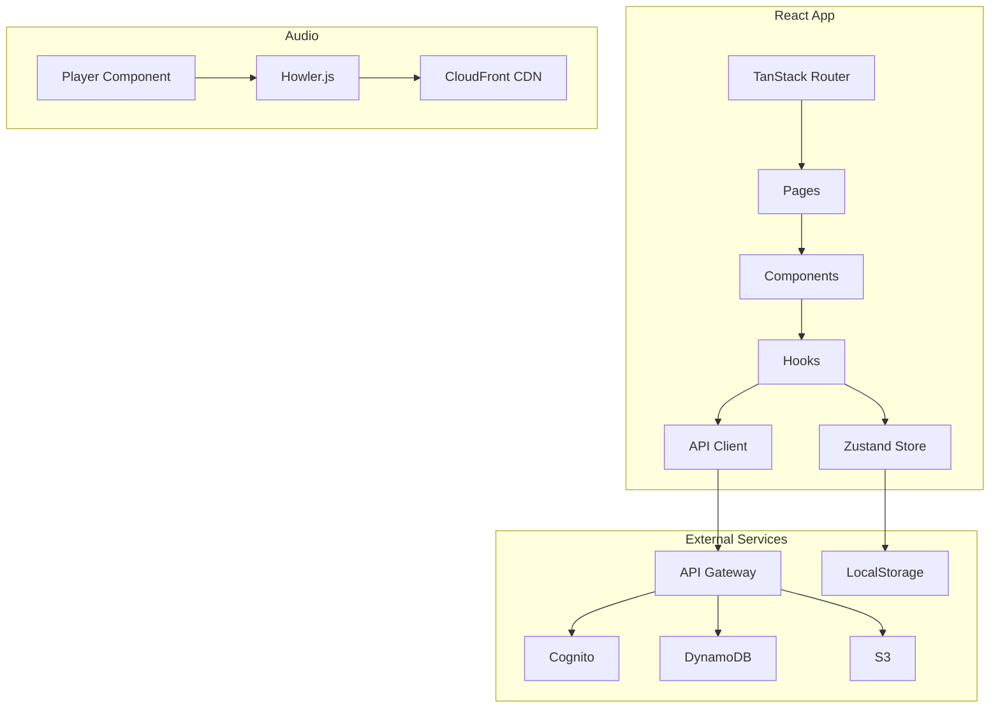

# Design Document - Epic 5: Frontend

## Overview

The frontend is a React single-page application that provides the user interface for the Personal Music Search Engine. It integrates with the backend API (29 endpoints) via TanStack Query for data fetching, uses Zustand for client state, and implements audio playback with Howler.js. The app follows a file-based routing pattern with TanStack Router.

## Code Reuse Analysis

### Existing Components to Leverage
- **Vite + React setup**: Already configured in `frontend/` with TypeScript, Tailwind, DaisyUI
- **Package dependencies**: TanStack Query/Router, Zustand, Howler.js, Amplify already in package.json
- **Tailwind config**: Custom dark/light themes with DaisyUI already defined
- **OpenAPI spec**: `backend/api/openapi.yaml` defines all API contracts for type generation

### Integration Points
- **Backend API**: `https://r1simytb2i.execute-api.us-east-1.amazonaws.com/api/v1/*`
- **Cognito**: User Pool `us-east-1_edxzNkQHw` for authentication
- **CloudFront**: Signed URLs for media streaming via `/stream/:trackId` endpoint
- **S3**: Direct upload via presigned URLs from `/upload/presigned`

## Architecture



### Modular Design Principles
- **Single File Responsibility**: Each component handles one UI concern
- **Component Isolation**: Atomic design - atoms, molecules, organisms
- **Service Layer Separation**: API client separate from UI components
- **Utility Modularity**: Focused utility modules (formatting, validation, etc.)

## Directory Structure

```
frontend/src/
├── components/
│   ├── layout/           # App shell components
│   │   ├── Layout.tsx
│   │   ├── Header.tsx
│   │   ├── Sidebar.tsx
│   │   └── Player.tsx
│   ├── library/          # Library view components
│   │   ├── TrackList.tsx
│   │   ├── TrackRow.tsx
│   │   ├── AlbumGrid.tsx
│   │   ├── AlbumCard.tsx
│   │   ├── ArtistList.tsx
│   │   └── ArtistCard.tsx
│   ├── player/           # Player components
│   │   ├── PlayerBar.tsx
│   │   ├── ProgressBar.tsx
│   │   ├── VolumeControl.tsx
│   │   ├── QueueDrawer.tsx
│   │   └── NowPlaying.tsx
│   ├── upload/           # Upload components
│   │   ├── UploadZone.tsx
│   │   ├── UploadProgress.tsx
│   │   └── UploadList.tsx
│   ├── search/           # Search components
│   │   ├── SearchBar.tsx
│   │   ├── SearchResults.tsx
│   │   └── Autocomplete.tsx
│   ├── playlist/         # Playlist components
│   │   ├── PlaylistCard.tsx
│   │   ├── PlaylistDetail.tsx
│   │   └── PlaylistEditor.tsx
│   ├── tag/              # Tag components
│   │   ├── TagChip.tsx
│   │   ├── TagSelector.tsx
│   │   └── TagManager.tsx
│   └── ui/               # Shared UI primitives
│       ├── Button.tsx
│       ├── Modal.tsx
│       ├── ContextMenu.tsx
│       ├── Skeleton.tsx
│       └── EmptyState.tsx
├── hooks/
│   ├── useAuth.ts        # Authentication hook
│   ├── useTracks.ts      # Track queries
│   ├── useAlbums.ts      # Album queries
│   ├── useArtists.ts     # Artist queries
│   ├── usePlaylists.ts   # Playlist queries
│   ├── useTags.ts        # Tag queries
│   ├── useUpload.ts      # Upload mutations
│   ├── useSearch.ts      # Search queries
│   ├── usePlayer.ts      # Player controls
│   └── useKeyboard.ts    # Keyboard shortcuts
├── lib/
│   ├── api/
│   │   ├── client.ts     # Axios instance with auth
│   │   ├── tracks.ts     # Track API functions
│   │   ├── albums.ts     # Album API functions
│   │   ├── playlists.ts  # Playlist API functions
│   │   ├── tags.ts       # Tag API functions
│   │   ├── upload.ts     # Upload API functions
│   │   ├── search.ts     # Search API functions
│   │   └── types.ts      # API response types
│   ├── auth.ts           # Amplify auth config
│   ├── store/
│   │   ├── player.ts     # Player state
│   │   ├── queue.ts      # Queue state
│   │   ├── theme.ts      # Theme state
│   │   └── ui.ts         # UI state (sidebar, modals)
│   ├── utils/
│   │   ├── format.ts     # Duration, file size formatting
│   │   ├── audio.ts      # Audio utilities
│   │   └── debounce.ts   # Debounce utility
│   └── constants.ts      # App constants
├── routes/
│   ├── __root.tsx        # Root layout with auth check
│   ├── index.tsx         # Home/dashboard
│   ├── login.tsx         # Login page
│   ├── tracks/
│   │   ├── index.tsx     # Track list
│   │   └── $trackId.tsx  # Track detail
│   ├── albums/
│   │   ├── index.tsx     # Album grid
│   │   └── $albumId.tsx  # Album detail
│   ├── artists/
│   │   ├── index.tsx     # Artist list
│   │   └── $artistName.tsx # Artist detail
│   ├── playlists/
│   │   ├── index.tsx     # Playlist list
│   │   └── $playlistId.tsx # Playlist detail
│   ├── tags/
│   │   ├── index.tsx     # Tag list
│   │   └── $tagName.tsx  # Tag tracks
│   ├── search.tsx        # Search results
│   └── upload.tsx        # Upload page
└── main.tsx              # App entry
```

## Components and Interfaces

### Layout Components

#### Layout
- **Purpose**: Main app shell with sidebar, header, content area, and player
- **Props**: `{ children: ReactNode }`
- **Dependencies**: Header, Sidebar, PlayerBar
- **State**: Sidebar collapsed state from useUIStore

#### Header
- **Purpose**: Top navigation with search, theme toggle, user menu
- **Props**: `{ onSearch: (query: string) => void }`
- **Dependencies**: SearchBar, ThemeToggle, UserMenu
- **Reuses**: DaisyUI navbar component

#### Sidebar
- **Purpose**: Navigation menu with library sections and playlists
- **Props**: `{ collapsed: boolean }`
- **Dependencies**: usePlaylists hook for playlist list
- **Reuses**: DaisyUI menu component

#### PlayerBar
- **Purpose**: Persistent audio player at bottom of screen
- **Props**: None (uses player store)
- **Dependencies**: usePlayer hook, NowPlaying, ProgressBar, VolumeControl
- **State**: Connected to player Zustand store

### Library Components

#### TrackList
- **Purpose**: Virtualized list of tracks with sorting
- **Props**: `{ tracks: Track[], onPlay: (track) => void, onContextMenu: (track, event) => void }`
- **Dependencies**: TrackRow, react-virtual for virtualization
- **Features**: Column sorting, infinite scroll, context menu

#### AlbumGrid
- **Purpose**: Responsive grid of album cards
- **Props**: `{ albums: Album[], onSelect: (album) => void }`
- **Dependencies**: AlbumCard
- **Features**: Lazy load images, hover play button

### Player Components

#### usePlayer Hook
```typescript
interface PlayerState {
  currentTrack: Track | null
  queue: Track[]
  queueIndex: number
  isPlaying: boolean
  progress: number
  duration: number
  volume: number
  shuffle: boolean
  repeat: 'none' | 'one' | 'all'
}

interface PlayerActions {
  play: () => void
  pause: () => void
  toggle: () => void
  next: () => void
  previous: () => void
  seek: (position: number) => void
  setVolume: (volume: number) => void
  setQueue: (tracks: Track[], startIndex?: number) => void
  addToQueue: (tracks: Track[], position?: 'next' | 'last') => void
  removeFromQueue: (index: number) => void
  toggleShuffle: () => void
  setRepeat: (mode: 'none' | 'one' | 'all') => void
}
```

## Data Models

### Track (from API)
```typescript
interface Track {
  id: string
  title: string
  artist: string
  albumArtist?: string
  album?: string
  albumId?: string
  genre?: string
  year?: number
  trackNumber?: number
  discNumber?: number
  duration: number
  durationStr: string
  format: string
  fileSize: number
  fileSizeStr: string
  coverArtUrl?: string
  playCount: number
  lastPlayed?: string
  tags: string[]
  createdAt: string
  updatedAt: string
}
```

### Album (from API)
```typescript
interface Album {
  id: string
  title: string
  artist: string
  albumArtist?: string
  genre?: string
  year?: number
  coverArtUrl?: string
  trackCount: number
  totalDuration: number
  durationStr: string
  discCount: number
  createdAt: string
  updatedAt: string
}
```

### Playlist (from API)
```typescript
interface Playlist {
  id: string
  name: string
  description?: string
  coverArtUrl?: string
  trackCount: number
  totalDuration: number
  durationStr: string
  isPublic: boolean
  createdAt: string
  updatedAt: string
}
```

### Client State Models
```typescript
interface PlayerStore {
  // State
  howl: Howl | null
  currentTrack: Track | null
  queue: Track[]
  queueIndex: number
  isPlaying: boolean
  progress: number
  volume: number
  shuffle: boolean
  repeat: 'none' | 'one' | 'all'

  // Actions
  loadTrack: (track: Track) => Promise<void>
  play: () => void
  pause: () => void
  // ... more actions
}

interface UIStore {
  sidebarCollapsed: boolean
  activeModal: string | null
  contextMenu: { x: number, y: number, track: Track } | null

  toggleSidebar: () => void
  openModal: (id: string) => void
  closeModal: () => void
  showContextMenu: (x: number, y: number, track: Track) => void
  hideContextMenu: () => void
}
```

## Error Handling

### Error Scenarios

1. **Network Error**
   - **Handling**: TanStack Query retry with exponential backoff (3 retries)
   - **User Impact**: Toast notification "Connection lost. Retrying..."

2. **Authentication Expired**
   - **Handling**: Axios interceptor catches 401, attempts token refresh
   - **User Impact**: Silent refresh or redirect to login

3. **Upload Failed**
   - **Handling**: Show error in upload progress, allow retry
   - **User Impact**: "Upload failed: [reason]. Click to retry"

4. **Playback Error**
   - **Handling**: Howler error event, skip to next track
   - **User Impact**: Toast "Couldn't play [track]. Skipping..."

5. **API Validation Error (400)**
   - **Handling**: Parse error response, show field-level errors
   - **User Impact**: Inline form validation messages

## Testing Strategy

### Unit Testing
- Test all Zustand stores with mock actions
- Test utility functions (formatting, validation)
- Test hooks with React Testing Library + MSW for API mocking
- Target: 80% coverage on lib/ and hooks/

### Integration Testing
- Test complete user flows (login → browse → play)
- Test upload flow with mocked S3
- Test search with filters
- Use Vitest + Testing Library

### End-to-End Testing
- Critical paths with Playwright
- Scenarios:
  1. Login and browse library
  2. Upload a track and verify processing
  3. Create playlist and add tracks
  4. Search and play results
  5. Tag management

## Implementation Waves

### Wave 1: Foundation (REQ-5.1, REQ-5.2)
- Auth configuration and login page
- App shell (Layout, Header, Sidebar)
- Protected routes
- Theme switching

### Wave 2: Library Views (REQ-5.3, REQ-5.4)
- Track list with infinite scroll
- Album grid view
- Artist list view
- Detail pages for album/artist

### Wave 3: Playback (REQ-5.6, REQ-5.7)
- Howler.js integration
- Player bar component
- Queue management
- Shuffle/repeat modes

### Wave 4: Upload & Search (REQ-5.5, REQ-5.8)
- Upload zone with drag-drop
- Progress tracking
- Search bar with autocomplete
- Search results with filters

### Wave 5: Organization (REQ-5.9, REQ-5.10, REQ-5.11)
- Playlist CRUD
- Tag management
- Track editing modal
- Cover art upload
