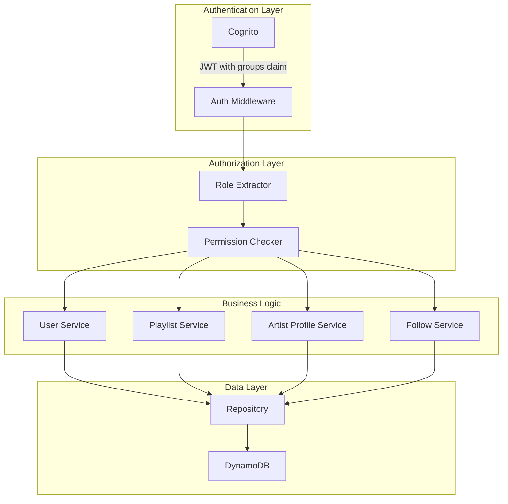

# Design Document: Global User Type

**Status**: ✅ IMPLEMENTED (2026-01-26)

## Overview

This design extends the Personal Music Search Engine from a single-user library to a multi-user platform with role-based access control, public playlists, artist profiles linked to the catalog, and a follow system.

**Key Decision:** This replaces the existing SubscriptionTier system. Subscriptions will be rebuilt in a future phase.

## Steering Document Alignment

### Technical Standards (tech.md)
- Go backend with existing service/repository pattern
- DynamoDB single-table design following existing PK/SK patterns
- **Cognito Groups** for role management (not custom attributes)
- TDD with 80%+ coverage requirement

### Project Structure (structure.md)
- New models in `backend/internal/models/`
- New services in `backend/internal/service/`
- New handlers in `backend/internal/handlers/`
- Frontend components in appropriate feature directories

## Code Reuse Analysis

### Existing Components to Leverage
- **User model**: Extend with Role field
- **Artist model**: Link from ArtistProfile (not replaced)
- **Playlist model**: Extend `IsPublic` to `Visibility` enum
- **Auth middleware**: Extend for role-based access

### Integration Points
- **Cognito**: Use Groups for role management (admin, artist, subscriber)
- **DynamoDB**: Add new entity types (ARTIST_PROFILE, FOLLOW)
- **Existing Artist**: ArtistProfile links to Artist.id for catalog integration

### Components to Remove/Replace
- **SubscriptionTier**: Remove from User model, feature flags, etc.
- **TierConfig**: Remove subscription pricing configuration
- **Feature flags based on tier**: Simplify to role-based permissions

---

## Architecture



### Modular Design Principles
- **Single File Responsibility**: Role checking in `role.go`, profiles in `artist_profile.go`
- **Component Isolation**: Authorization middleware separate from handlers
- **Service Layer Separation**: Permission logic in middleware, business logic in services

---

## Components and Interfaces

### Component 1: Role Service
- **Purpose**: Extract and validate user roles from Cognito groups
- **Interfaces**:
  ```go
  type RoleService interface {
      GetUserRole(ctx context.Context, userID string) (UserRole, error)
      SetUserRole(ctx context.Context, userID string, role UserRole) error // Admin only
      HasPermission(ctx context.Context, userID string, permission Permission) (bool, error)
  }
  ```
- **Dependencies**: Cognito Admin API, Repository
- **Implementation**: Roles stored in Cognito Groups, synced to DynamoDB User record

### Component 2: Artist Profile Service
- **Purpose**: Manage artist profiles and catalog linking
- **Interfaces**:
  ```go
  type ArtistProfileService interface {
      CreateProfile(ctx context.Context, userID string, req CreateArtistProfileRequest) (*ArtistProfile, error)
      GetProfile(ctx context.Context, profileID string) (*ArtistProfile, error)
      GetProfileByUserID(ctx context.Context, userID string) (*ArtistProfile, error)
      UpdateProfile(ctx context.Context, profileID string, req UpdateArtistProfileRequest) (*ArtistProfile, error)
      LinkToArtist(ctx context.Context, profileID string, artistID string) error // Claim catalog artist
      GetProfileWithCatalog(ctx context.Context, profileID string) (*ArtistProfileWithCatalog, error)
  }
  ```
- **Dependencies**: Repository, existing Artist service
- **Reuses**: Existing Artist model for catalog data

### Component 3: Follow Service
- **Purpose**: Manage user-to-artist-profile follows
- **Interfaces**:
  ```go
  type FollowService interface {
      Follow(ctx context.Context, userID string, artistProfileID string) error
      Unfollow(ctx context.Context, userID string, artistProfileID string) error
      GetFollowers(ctx context.Context, artistProfileID string, pagination Pagination) (*PaginatedResponse[User], error)
      GetFollowing(ctx context.Context, userID string, pagination Pagination) (*PaginatedResponse[ArtistProfile], error)
      IsFollowing(ctx context.Context, userID string, artistProfileID string) (bool, error)
  }
  ```
- **Dependencies**: Repository, ArtistProfileService

### Component 4: Authorization Middleware
- **Purpose**: Enforce role-based access on API endpoints
- **Interfaces**:
  ```go
  func RequireRole(roles ...UserRole) echo.MiddlewareFunc
  func RequireAuth() echo.MiddlewareFunc // Any authenticated user
  func OptionalAuth() echo.MiddlewareFunc // Guest allowed
  ```
- **Dependencies**: JWT claims from Cognito
- **Reuses**: Existing auth middleware pattern

---

## Data Models

### UserRole (new type in `role.go`)
```go
type UserRole string

const (
    RoleGuest      UserRole = "guest"      // Implicit - unauthenticated
    RoleSubscriber UserRole = "subscriber" // Default for authenticated users
    RoleArtist     UserRole = "artist"     // Can manage artist profile
    RoleAdmin      UserRole = "admin"      // Full access
)

// CognitoGroupName returns the Cognito group name for the role
func (r UserRole) CognitoGroupName() string {
    switch r {
    case RoleAdmin:
        return "admin"
    case RoleArtist:
        return "artist"
    default:
        return "subscriber"
    }
}
```

### Permission (new type in `role.go`)
```go
type Permission string

const (
    // Public access
    PermissionViewPublic Permission = "view:public"

    // Authenticated user permissions
    PermissionCreatePlaylist  Permission = "playlist:create"
    PermissionPublishPlaylist Permission = "playlist:publish"
    PermissionUploadContent   Permission = "content:upload"
    PermissionFollowArtist    Permission = "artist:follow"

    // Artist permissions
    PermissionManageProfile Permission = "profile:manage"
    PermissionLinkCatalog   Permission = "catalog:link"

    // Admin permissions
    PermissionManageUsers Permission = "admin:users"
    PermissionManageRoles Permission = "admin:roles"
)

// RolePermissions maps roles to their permissions
var RolePermissions = map[UserRole][]Permission{
    RoleGuest: {
        PermissionViewPublic,
    },
    RoleSubscriber: {
        PermissionViewPublic,
        PermissionCreatePlaylist,
        PermissionPublishPlaylist,
        PermissionUploadContent,
        PermissionFollowArtist,
    },
    RoleArtist: {
        PermissionViewPublic,
        PermissionCreatePlaylist,
        PermissionPublishPlaylist,
        PermissionUploadContent,
        PermissionFollowArtist,
        PermissionManageProfile,
        PermissionLinkCatalog,
    },
    RoleAdmin: {
        // All permissions - checked specially
    },
}
```

### User (modified in `user.go`)
```go
type User struct {
    ID          string   `json:"id" dynamodbav:"id"`
    Email       string   `json:"email" dynamodbav:"email"`
    DisplayName string   `json:"displayName" dynamodbav:"displayName"`
    AvatarURL   string   `json:"avatarUrl,omitempty" dynamodbav:"avatarUrl,omitempty"`
    Role        UserRole `json:"role" dynamodbav:"role"` // NEW - replaces Tier
    Timestamps
    StorageUsed   int64 `json:"storageUsed" dynamodbav:"storageUsed"`
    StorageLimit  int64 `json:"storageLimit" dynamodbav:"storageLimit"` // Keep for now, simplify later
    TrackCount    int   `json:"trackCount" dynamodbav:"trackCount"`
    AlbumCount    int   `json:"albumCount" dynamodbav:"albumCount"`
    PlaylistCount int   `json:"playlistCount" dynamodbav:"playlistCount"`
    FollowingCount int  `json:"followingCount" dynamodbav:"followingCount"` // NEW
}

// REMOVE: Tier field, TierConfig references
```

### PlaylistVisibility (new type in `playlist.go`)
```go
type PlaylistVisibility string

const (
    VisibilityPrivate  PlaylistVisibility = "private"  // Owner only
    VisibilityUnlisted PlaylistVisibility = "unlisted" // Anyone with link
    VisibilityPublic   PlaylistVisibility = "public"   // Discoverable
)
```

### Playlist (modified in `playlist.go`)
```go
type Playlist struct {
    ID            string             `json:"id" dynamodbav:"id"`
    UserID        string             `json:"userId" dynamodbav:"userId"`
    Name          string             `json:"name" dynamodbav:"name"`
    Description   string             `json:"description,omitempty" dynamodbav:"description,omitempty"`
    CoverArtKey   string             `json:"coverArtKey,omitempty" dynamodbav:"coverArtKey,omitempty"`
    TrackCount    int                `json:"trackCount" dynamodbav:"trackCount"`
    TotalDuration int                `json:"totalDuration" dynamodbav:"totalDuration"`
    Visibility    PlaylistVisibility `json:"visibility" dynamodbav:"visibility"` // REPLACES IsPublic
    // Denormalized creator info for public playlists
    CreatorName   string `json:"creatorName,omitempty" dynamodbav:"creatorName,omitempty"`
    CreatorAvatar string `json:"creatorAvatar,omitempty" dynamodbav:"creatorAvatar,omitempty"`
    Timestamps
}

// REMOVE: IsPublic bool field
```

### ArtistProfile (new type in `artist_profile.go`)
```go
type ArtistProfile struct {
    ID             string            `json:"id" dynamodbav:"id"`
    UserID         string            `json:"userId" dynamodbav:"userId"`
    DisplayName    string            `json:"displayName" dynamodbav:"displayName"`
    Bio            string            `json:"bio,omitempty" dynamodbav:"bio,omitempty"`
    AvatarURL      string            `json:"avatarUrl,omitempty" dynamodbav:"avatarUrl,omitempty"`
    HeaderImageURL string            `json:"headerImageUrl,omitempty" dynamodbav:"headerImageUrl,omitempty"`
    SocialLinks    map[string]string `json:"socialLinks,omitempty" dynamodbav:"socialLinks,omitempty"`
    LinkedArtistID string            `json:"linkedArtistId,omitempty" dynamodbav:"linkedArtistId,omitempty"` // Links to Artist catalog
    FollowerCount  int               `json:"followerCount" dynamodbav:"followerCount"`
    TrackCount     int               `json:"trackCount" dynamodbav:"trackCount"` // From linked Artist
    Timestamps
}

// ArtistProfileItem for DynamoDB
// PK: ARTIST_PROFILE#{id}, SK: PROFILE
// GSI1PK: USER#{userId}, GSI1SK: ARTIST_PROFILE (user -> profile lookup)
// GSI2PK: LINKED_ARTIST#{artistId}, GSI2SK: ARTIST_PROFILE (prevent duplicate claims)
type ArtistProfileItem struct {
    DynamoDBItem
    ArtistProfile
}

func NewArtistProfileItem(profile ArtistProfile) ArtistProfileItem {
    item := ArtistProfileItem{
        DynamoDBItem: DynamoDBItem{
            PK:     fmt.Sprintf("ARTIST_PROFILE#%s", profile.ID),
            SK:     "PROFILE",
            Type:   "ARTIST_PROFILE",
            GSI1PK: fmt.Sprintf("USER#%s", profile.UserID),
            GSI1SK: "ARTIST_PROFILE",
        },
        ArtistProfile: profile,
    }
    return item
}
```

### Follow (new type in `follow.go`)
```go
type Follow struct {
    FollowerUserID  string    `json:"followerUserId" dynamodbav:"followerUserId"`
    ArtistProfileID string    `json:"artistProfileId" dynamodbav:"artistProfileId"`
    FollowedAt      time.Time `json:"followedAt" dynamodbav:"followedAt"`
}

// FollowItem for DynamoDB
// PK: USER#{followerUserId}, SK: FOLLOW#{artistProfileId}
// GSI1PK: ARTIST_PROFILE#{artistProfileId}, GSI1SK: {followedAt} (artist's followers)
type FollowItem struct {
    DynamoDBItem
    Follow
}

func NewFollowItem(follow Follow) FollowItem {
    return FollowItem{
        DynamoDBItem: DynamoDBItem{
            PK:     fmt.Sprintf("USER#%s", follow.FollowerUserID),
            SK:     fmt.Sprintf("FOLLOW#%s", follow.ArtistProfileID),
            Type:   "FOLLOW",
            GSI1PK: fmt.Sprintf("ARTIST_PROFILE#%s", follow.ArtistProfileID),
            GSI1SK: follow.FollowedAt.Format(time.RFC3339),
        },
        Follow: follow,
    }
}
```

---

## DynamoDB Access Patterns

### New Entity Types
| Entity | PK | SK | GSI1PK | GSI1SK |
|--------|----|----|--------|--------|
| ArtistProfile | `ARTIST_PROFILE#{id}` | `PROFILE` | `USER#{userId}` | `ARTIST_PROFILE` |
| Follow | `USER#{userId}` | `FOLLOW#{profileId}` | `ARTIST_PROFILE#{profileId}` | `{followedAt}` |

### Updated Playlist for Public Discovery
| Entity | PK | SK | GSI2PK | GSI2SK |
|--------|----|----|--------|--------|
| Playlist (public) | `USER#{userId}` | `PLAYLIST#{id}` | `VISIBILITY#public` | `{createdAt}` |

### Access Pattern Summary
| Pattern | Query |
|---------|-------|
| Get user's profile | PK = `USER#{userId}`, SK = `PROFILE` |
| Get artist profile by ID | PK = `ARTIST_PROFILE#{id}`, SK = `PROFILE` |
| Get artist profile by user | GSI1: PK = `USER#{userId}`, SK = `ARTIST_PROFILE` |
| Check if artist claimed | GSI2: PK = `LINKED_ARTIST#{artistId}` |
| Get user's following | PK = `USER#{userId}`, SK begins_with `FOLLOW#` |
| Get artist's followers | GSI1: PK = `ARTIST_PROFILE#{profileId}` |
| Discover public playlists | GSI2: PK = `VISIBILITY#public` |

---

## API Endpoints

### Role Management (Admin only)
| Method | Path | Description | Auth |
|--------|------|-------------|------|
| GET | `/api/v1/users/:id/role` | Get user's role | Admin |
| PUT | `/api/v1/users/:id/role` | Set user's role | Admin |

### Artist Profiles
| Method | Path | Description | Auth |
|--------|------|-------------|------|
| POST | `/api/v1/artist-profiles` | Create artist profile | Artist |
| GET | `/api/v1/artist-profiles/:id` | Get artist profile | Public |
| PUT | `/api/v1/artist-profiles/:id` | Update artist profile | Owner |
| POST | `/api/v1/artist-profiles/:id/link` | Link to catalog artist | Owner |
| GET | `/api/v1/artist-profiles/:id/catalog` | Get linked catalog data | Public |
| GET | `/api/v1/artist-profiles/discover` | Discover artist profiles | Public |

### Follow System
| Method | Path | Description | Auth |
|--------|------|-------------|------|
| POST | `/api/v1/artist-profiles/:id/follow` | Follow an artist | Subscriber+ |
| DELETE | `/api/v1/artist-profiles/:id/follow` | Unfollow an artist | Subscriber+ |
| GET | `/api/v1/artist-profiles/:id/followers` | Get artist's followers | Public |
| GET | `/api/v1/users/me/following` | Get current user's following | Subscriber+ |

### Public Playlists (extend existing)
| Method | Path | Description | Auth |
|--------|------|-------------|------|
| GET | `/api/v1/playlists/public` | Discover public playlists | Public |
| PUT | `/api/v1/playlists/:id/visibility` | Update playlist visibility | Owner |

---

## Cognito Configuration

### Groups to Create
| Group | Description |
|-------|-------------|
| `admin` | Platform administrators |
| `artist` | Verified artists with profiles |
| `subscriber` | Default group for authenticated users |

### Bootstrap Script
```bash
#!/bin/bash
# scripts/bootstrap-admin.sh

USER_POOL_ID="us-east-1_XXXXX"
ADMIN_EMAIL="gvasels90@gmail.com"

# Get user by email
USERNAME=$(aws cognito-idp list-users \
  --user-pool-id $USER_POOL_ID \
  --filter "email = \"$ADMIN_EMAIL\"" \
  --query 'Users[0].Username' --output text)

# Add to admin group
aws cognito-idp admin-add-user-to-group \
  --user-pool-id $USER_POOL_ID \
  --username $USERNAME \
  --group-name admin

echo "Added $ADMIN_EMAIL to admin group"
```

### Token Claims
JWT will include `cognito:groups` claim:
```json
{
  "sub": "user-uuid",
  "cognito:groups": ["subscriber", "artist"],
  "email": "user@example.com"
}
```

Highest role wins: admin > artist > subscriber > guest

---

## Migration Strategy

### Phase 1: Add New Fields (Non-breaking)
1. Add `Role` field to User with default `subscriber`
2. Add `Visibility` to Playlist
3. Create migration script: `IsPublic: true` → `public`, `false` → `private`
4. Add `FollowingCount` to User (default 0)

### Phase 2: Create Cognito Groups
1. Create admin, artist, subscriber groups in Cognito
2. Run bootstrap script to add initial admin
3. Migrate existing users to subscriber group

### Phase 3: Remove SubscriptionTier
1. Remove `Tier` field from User model
2. Remove `TierConfig`, feature flag tier logic
3. Update frontend to use roles instead of tiers

### Phase 4: Add New Entities
1. Create ArtistProfile entity
2. Create Follow entity
3. Add new GSIs for discovery

### Phase 5: Update API
1. Add role middleware to protected endpoints
2. Add new endpoints for profiles and follows
3. Update frontend for new features

---

## Error Handling

### Error Scenarios

| Scenario | HTTP Status | Error Code | Message |
|----------|-------------|------------|---------|
| Insufficient role | 403 | `FORBIDDEN` | "Requires artist role" |
| Artist already claimed | 409 | `CONFLICT` | "Artist already linked to another profile" |
| Already following | 409 | `CONFLICT` | "Already following this artist" |
| Not following | 404 | `NOT_FOUND` | "Not following this artist" |
| Self-follow | 400 | `BAD_REQUEST` | "Cannot follow yourself" |
| Profile not found | 404 | `NOT_FOUND` | "Artist profile not found" |

---

## Testing Strategy

### Unit Testing
- Role permission mapping validation
- Visibility enum handling
- Service layer with mocked repository
- Cognito group extraction from JWT

### Integration Testing
- Role-based endpoint access
- Follow/unfollow operations
- Public playlist discovery
- Artist profile creation and linking

### End-to-End Testing
- Complete artist profile creation flow
- User following multiple artists
- Public playlist visibility changes
- Admin role assignment

---

## Implementation Notes (2026-01-26)

### Key Implementation Details

#### JWT Groups Parsing
API Gateway passes Cognito groups as `"[admin subscriber]"` format (brackets included). The auth middleware strips brackets before parsing:

```go
// parseGroups handles API Gateway's array format
func parseGroups(groupsClaim string) []string {
    groupsClaim = strings.TrimPrefix(groupsClaim, "[")
    groupsClaim = strings.TrimSuffix(groupsClaim, "]")
    return strings.Split(strings.TrimSpace(groupsClaim), " ")
}
```

#### Admin Panel Architecture
- **Source of Truth**: Currently Cognito for user search (future: DynamoDB)
- **CognitoClient**: Wraps AWS SDK for admin operations
- **AdminService**: Orchestrates Cognito + DynamoDB operations
- **Rollback Logic**: On Cognito failure, reverts DynamoDB changes

#### Files Implemented

**Backend:**
- `backend/internal/models/role.go` - UserRole, Permission types
- `backend/internal/models/artist_profile.go` - ArtistProfile model
- `backend/internal/models/follow.go` - Follow model
- `backend/internal/service/role.go` - RoleService
- `backend/internal/service/artist_profile.go` - ArtistProfileService
- `backend/internal/service/follow.go` - FollowService
- `backend/internal/service/admin.go` - AdminService
- `backend/internal/service/cognito_client.go` - CognitoClient
- `backend/internal/handlers/middleware/auth.go` - Role middleware
- `backend/internal/handlers/artist_profile.go` - Artist profile handlers
- `backend/internal/handlers/follow.go` - Follow handlers
- `backend/internal/handlers/admin.go` - Admin handlers

**Frontend:**
- `frontend/src/components/admin/` - Admin panel components
- `frontend/src/components/artist-profile/` - Artist profile components
- `frontend/src/components/follow/` - Follow components
- `frontend/src/components/playlist/VisibilitySelector.tsx` - Visibility UI
- `frontend/src/lib/api/artistProfiles.ts` - API client
- `frontend/src/lib/api/follows.ts` - API client
- `frontend/src/hooks/useAdmin.ts` - Admin hooks
- `frontend/src/routes/admin/users.tsx` - Admin page

**Infrastructure:**
- `infrastructure/shared/main.tf` - Cognito groups
- `scripts/bootstrap-admin.sh` - Admin bootstrap
- `scripts/migrations/` - Data migration scripts
