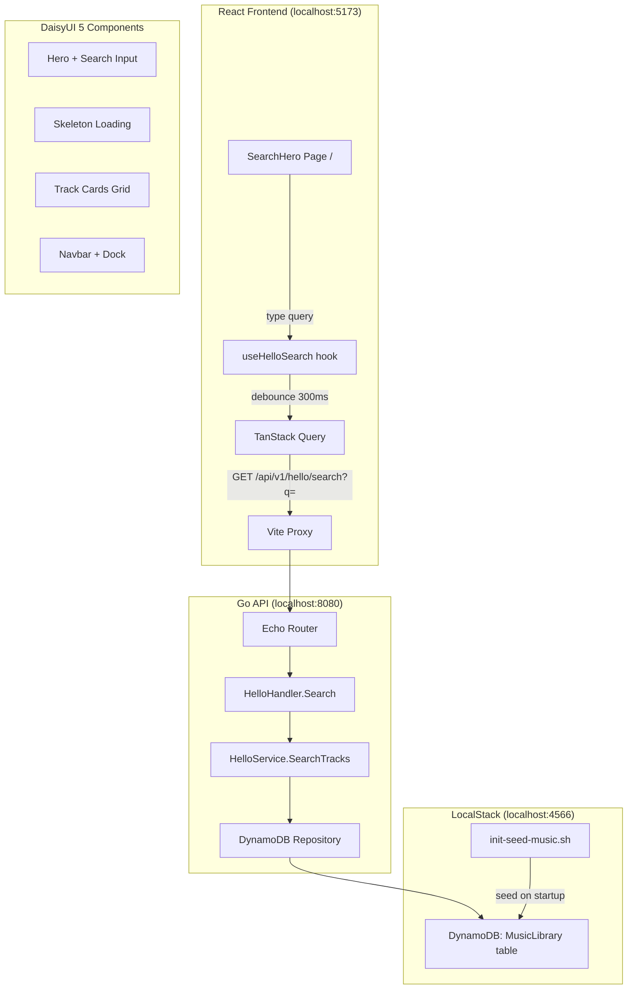

# Design: Hello World Local Dev Validation

## Overview

A minimal end-to-end validation of the local development stack: Go API (Echo v4) + React frontend (TanStack Router/Query + DaisyUI 5) + LocalStack (DynamoDB). Adds a simple DynamoDB-based search endpoint (no Nixiesearch dependency), seeds mock music data, and builds a polished media search UI using DaisyUI 5 components.

## Steering Document Alignment

### Technical Standards
- **Backend**: Go 1.22+, Echo v4, existing handler/service/repository pattern
- **Frontend**: React 18, TanStack Router file-based routing, TanStack Query v5, Zustand, DaisyUI 5, Vite
- **Data**: DynamoDB single-table design, existing `MusicLibrary` table
- **Local Dev**: LocalStack via `make local`, Go HTTP server mode (not Lambda)

### Project Structure
- Backend code in `backend/internal/{handlers,service,repository}/`
- Frontend components in `frontend/src/components/`
- Frontend routes in `frontend/src/routes/`
- Seed scripts in `docker/localstack-init/`

## Code Reuse Analysis

### Existing Components to Leverage
- **`backend/cmd/api/main.go`**: HTTP server startup pattern, route registration
- **`backend/internal/handlers/`**: Handler registration pattern, auth middleware (optional for public search)
- **`backend/internal/repository/dynamodb.go`**: DynamoDB client, table operations
- **`backend/internal/models/track.go`**: Track model, TrackResponse, TrackItem
- **`frontend/src/lib/api/client.ts`**: Axios client with API base URL
- **`frontend/src/components/layout/`**: Layout shell (Header, Sidebar)
- **`frontend/src/components/search/SearchBar.tsx`**: Existing search component (reference)
- **`frontend/src/lib/store/themeStore.ts`**: Theme persistence
- **`frontend/src/hooks/useSearch.ts`**: Search hook pattern (reference)

### Integration Points
- **DynamoDB**: Uses existing `MusicLibrary` table with `USER#` / `TRACK#` key pattern
- **Vite Dev Proxy**: Frontend `/api` proxied to `http://localhost:8080`
- **LocalStack**: Uses existing `docker/docker-compose.yml` and init scripts

## Architecture



### Modular Design Principles
- **Single File Responsibility**: Each handler, service, hook, and component in its own file
- **Component Isolation**: Search UI components are standalone, no coupling to auth or player
- **Service Layer Separation**: HelloService handles business logic, repository handles DynamoDB
- **No Auth Required**: Hello-world search is public (no JWT middleware)

## Components and Interfaces

### Backend Components

#### Component: HelloHandler
- **Purpose**: HTTP handler for hello-world search endpoint
- **File**: `backend/internal/handlers/hello.go`
- **Interfaces**:
  ```go
  func (h *Handlers) HelloHealth(c echo.Context) error
  func (h *Handlers) HelloSearch(c echo.Context) error
  ```
- **Dependencies**: HelloService
- **Reuses**: Existing `Handlers` struct from `handlers.go`, Echo context patterns

#### Component: HelloService
- **Purpose**: Business logic for searching mock tracks
- **File**: `backend/internal/service/hello.go`
- **Interfaces**:
  ```go
  func (s *HelloService) SearchTracks(ctx context.Context, query string, limit int) ([]models.TrackResponse, error)
  ```
- **Dependencies**: DynamoDB Repository
- **Reuses**: Existing repository scan patterns

#### Component: Seed Script
- **Purpose**: Seed 20 mock tracks across 5 artists into DynamoDB
- **File**: `docker/localstack-init/init-seed-music.sh`
- **Interfaces**: Bash script executed after `init-aws.sh`
- **Dependencies**: AWS CLI (available in LocalStack container)

### Frontend Components

#### Component: SearchHeroPage
- **Purpose**: Home page with hero section and prominent search
- **File**: `frontend/src/routes/hello-search.tsx`
- **Route**: `/hello-search`
- **Interfaces**: React component (no props)
- **Dependencies**: `useHelloSearch` hook, `TrackCard`, `SearchInput`
- **Reuses**: TanStack Router route pattern

#### Component: SearchInput
- **Purpose**: Styled search input with icon and keyboard handling
- **File**: `frontend/src/components/hello/SearchInput.tsx`
- **Interfaces**:
  ```tsx
  interface SearchInputProps {
    value: string;
    onChange: (value: string) => void;
    onSubmit?: () => void;
    placeholder?: string;
    autoFocus?: boolean;
  }
  ```
- **Reuses**: DaisyUI `input` + `join` components

#### Component: TrackCard
- **Purpose**: Media card displaying track info with album art placeholder
- **File**: `frontend/src/components/hello/TrackCard.tsx`
- **Interfaces**:
  ```tsx
  interface TrackCardProps {
    track: HelloTrack;
  }
  ```
- **Reuses**: DaisyUI `card`, `badge` components

#### Component: TrackCardSkeleton
- **Purpose**: Loading placeholder for track cards
- **File**: `frontend/src/components/hello/TrackCardSkeleton.tsx`
- **Interfaces**: React component (no props)
- **Reuses**: DaisyUI `skeleton` component

#### Component: HelloNav
- **Purpose**: Navigation bar with search and responsive dock
- **File**: `frontend/src/components/hello/HelloNav.tsx`
- **Interfaces**: React component (no props)
- **Reuses**: DaisyUI `navbar`, `dock` components

#### Hook: useHelloSearch
- **Purpose**: TanStack Query hook for hello search API
- **File**: `frontend/src/hooks/useHelloSearch.ts`
- **Interfaces**:
  ```tsx
  function useHelloSearch(query: string): {
    data: HelloTrack[] | undefined;
    isLoading: boolean;
    isError: boolean;
    error: Error | null;
  }
  ```
- **Reuses**: TanStack Query `useQuery` pattern from existing hooks

#### API Client: Hello Search
- **Purpose**: API client function for hello search endpoint
- **File**: `frontend/src/lib/api/helloSearch.ts`
- **Interfaces**:
  ```tsx
  interface HelloTrack {
    id: string;
    title: string;
    artist: string;
    album: string;
    genre: string;
    year: number;
    duration: number;
    durationStr: string;
    coverArtUrl: string;
  }

  interface HelloSearchResponse {
    tracks: HelloTrack[];
    total: number;
    query: string;
  }

  function searchHello(query: string): Promise<HelloSearchResponse>
  ```

## Data Models

### Backend: HelloSearchResponse
```go
type HelloSearchResponse struct {
    Tracks []TrackResponse `json:"tracks"`
    Total  int             `json:"total"`
    Query  string          `json:"query"`
}
```

### Mock Track Seed Data

5 artists, 4 tracks each = 20 tracks:

| Artist | Tracks | Genre |
|--------|--------|-------|
| Luna Waves | "Midnight Drift", "Solar Wind", "Neon Pulse", "Crystal Shore" | Electronic |
| The Ember Collective | "Burning Ground", "Ashfall", "Smoke Signals", "Wildfire" | Indie Rock |
| DJ Phantom | "Ghost Protocol", "Phantom Zone", "Shadow Drop", "Dark Frequency" | House |
| Aria Chen | "Silk Road", "Paper Crane", "Jade Garden", "Moonlight Sonata" | Classical Crossover |
| Voltage | "Circuit Break", "Overload", "Wired", "Blackout" | Techno |

Each track includes: title, artist, album (artist's album name), genre, year (2022-2025), duration (180-360 seconds), cover art URL (placeholder via `https://placehold.co/300x300/1a1a2e/e0e0e0?text={ArtistInitials}`).

### DynamoDB Item Format
```json
{
  "PK": {"S": "USER#seed-user"},
  "SK": {"S": "TRACK#<uuid>"},
  "Type": {"S": "TRACK"},
  "id": {"S": "<uuid>"},
  "userId": {"S": "seed-user"},
  "title": {"S": "Midnight Drift"},
  "artist": {"S": "Luna Waves"},
  "album": {"S": "Waveforms"},
  "genre": {"S": "Electronic"},
  "year": {"N": "2024"},
  "duration": {"N": "240"},
  "format": {"S": "MP3"},
  "fileSize": {"N": "5242880"},
  "s3Key": {"S": "uploads/seed-user/midnight-drift.mp3"},
  "Visibility": {"S": "public"},
  "createdAt": {"S": "2024-01-15T00:00:00Z"},
  "updatedAt": {"S": "2024-01-15T00:00:00Z"}
}
```

## API Endpoints

### `GET /api/v1/health`
- **Purpose**: Health check
- **Response**: `200 OK`
  ```json
  {"status": "ok"}
  ```

### `GET /api/v1/hello/search?q={term}`
- **Purpose**: Search seeded tracks by title, artist, or genre
- **Query Parameters**:
  - `q` (required): Search term (min 1 char, max 100 chars)
  - `limit` (optional): Max results (default 20, max 50)
- **Response**: `200 OK`
  ```json
  {
    "tracks": [
      {
        "id": "uuid",
        "title": "Midnight Drift",
        "artist": "Luna Waves",
        "album": "Waveforms",
        "genre": "Electronic",
        "year": 2024,
        "duration": 240,
        "durationStr": "4:00",
        "coverArtUrl": "https://placehold.co/300x300/1a1a2e/e0e0e0?text=LW"
      }
    ],
    "total": 3,
    "query": "luna"
  }
  ```
- **Response**: `400 Bad Request` (missing query)
  ```json
  {"error": "query parameter 'q' is required"}
  ```

### `GET /api/v1/hello/featured`
- **Purpose**: Return all seeded tracks for the featured section
- **Response**: `200 OK` (same structure as search, `query` is empty string)

## Error Handling

### Error Scenarios

1. **Missing query parameter**
   - **Handling**: Return `400 Bad Request` with error message
   - **User Impact**: Search input shows validation message

2. **DynamoDB connection failure**
   - **Handling**: Return `500 Internal Server Error`, log error
   - **User Impact**: Error alert shown with retry button (TanStack Query retry)

3. **No results found**
   - **Handling**: Return `200 OK` with empty tracks array
   - **User Impact**: Empty state with "No tracks found for '{query}'" message

## UI Design (DaisyUI 5)

### Home Page Layout (`/hello-search`)

```
┌──────────────────────────────────────────────────────────┐
│ navbar [Logo] [Search Input...........] [Theme Toggle]   │
├──────────────────────────────────────────────────────────┤
│                                                          │
│                    ♪ Music Search                        │  hero
│              Find your next favorite track               │
│         ┌─────────────────────────────────┐              │
│         │ 🔍 Search tracks, artists...    │              │  input
│         └─────────────────────────────────┘              │
│                                                          │
├──────────────────────────────────────────────────────────┤
│  Featured Tracks (or "Found N tracks for 'query'")       │
├──────────────────────────────────────────────────────────┤
│ ┌─────────┐ ┌─────────┐ ┌─────────┐ ┌─────────┐        │
│ │ ░░░░░░░ │ │ ░░░░░░░ │ │ ░░░░░░░ │ │ ░░░░░░░ │        │  card grid
│ │ Title   │ │ Title   │ │ Title   │ │ Title   │        │  (responsive
│ │ Artist  │ │ Artist  │ │ Artist  │ │ Artist  │        │   1-4 cols)
│ │ [Genre] │ │ [Genre] │ │ [Genre] │ │ [Genre] │        │
│ │  4:00   │ │  3:30   │ │  5:15   │ │  3:45   │        │
│ └─────────┘ └─────────┘ └─────────┘ └─────────┘        │
│                                                          │
│ ┌─────────┐ ┌─────────┐ ┌─────────┐ ┌─────────┐        │
│ │   ...   │ │   ...   │ │   ...   │ │   ...   │        │
│ └─────────┘ └─────────┘ └─────────┘ └─────────┘        │
├──────────────────────────────────────────────────────────┤
│ dock [🏠 Home] [🔍 Search] [ℹ️ About]  (mobile only)    │
└──────────────────────────────────────────────────────────┘
```

### DaisyUI Component Mapping

| UI Element | DaisyUI Component | Classes |
|------------|------------------|---------|
| Hero section | `hero` | `hero min-h-[40vh] bg-base-200` |
| Search input | `input` + `join` | `input input-bordered input-lg join-item w-full` |
| Search button | `btn` | `btn btn-primary join-item` |
| Track card | `card` | `card bg-base-100 shadow-xl image-full` or `card bg-base-200` |
| Card image | `card figure` | `figure` with `` |
| Genre badge | `badge` | `badge badge-primary badge-sm` |
| Loading skeleton | `skeleton` | `skeleton h-64 w-full` |
| Navbar | `navbar` | `navbar bg-base-100 shadow-lg` |
| Bottom dock | `dock` | `dock dock-lg` (mobile only, `lg:hidden`) |
| Empty state | Custom | `text-center text-base-content/60` |
| Result count | `text` | `text-sm text-base-content/60` |

### Responsive Breakpoints

| Viewport | Card Grid | Dock | Sidebar |
|----------|----------|------|---------|
| `< 640px` (sm) | 1 column | Visible | Hidden |
| `640-1023px` (md) | 2 columns | Visible | Hidden |
| `1024px+` (lg) | 3-4 columns | Hidden | Optional |

## Testing Strategy

### Unit Testing

**Backend (Go)**:
- `hello_test.go`: Test HelloService.SearchTracks with various queries
- `hello_handler_test.go`: Test HTTP handler with mock service
- Test cases: valid search, empty query (400), no results, case-insensitive matching

**Frontend (TypeScript/Vitest)**:
- `SearchInput.test.tsx`: Renders input, handles onChange, keyboard events
- `TrackCard.test.tsx`: Renders track info, genre badge, duration
- `TrackCardSkeleton.test.tsx`: Renders skeleton elements
- `useHelloSearch.test.ts`: Hook returns data, loading, error states
- `helloSearch.test.ts`: API client calls correct endpoint

### Integration Testing
- Existing `make test-integration` with LocalStack
- Verify seed data exists after `make local-services`

### End-to-End Testing
- `hello-search.spec.ts` (Playwright):
  - Page loads with hero and search input
  - Search input auto-focused
  - Type query -> debounce -> results appear
  - Empty query shows featured tracks
  - No results shows empty state
  - Responsive layout works on mobile viewport
