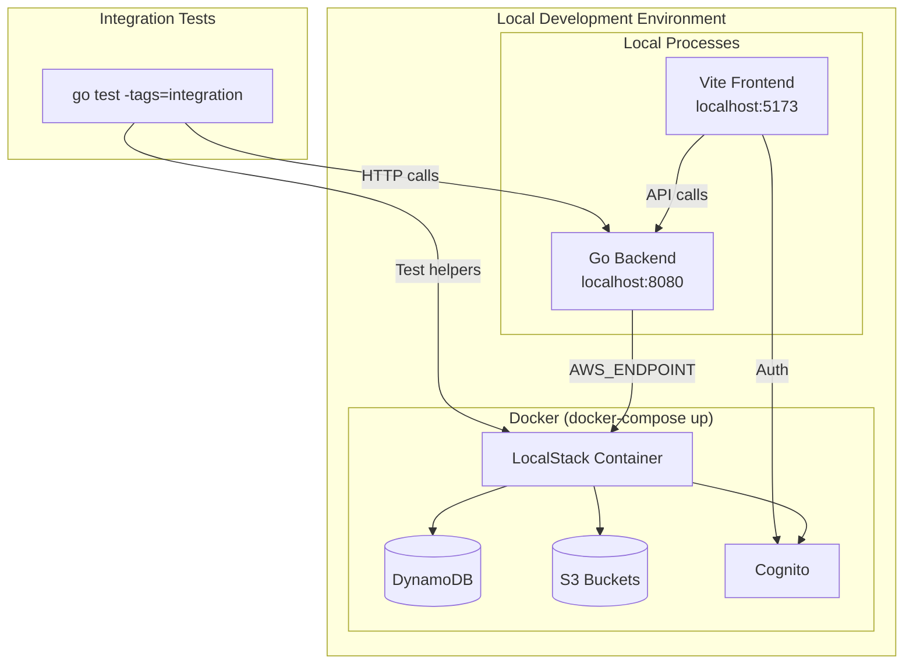

# Design Document: LocalStack Development Environment

## Overview

This design extends the existing LocalStack setup to provide a complete local development environment with Cognito authentication, integration testing framework, and one-command startup. The backend already supports LocalStack via `AWS_ENDPOINT` environment variable - this spec builds on that foundation.

## Existing Infrastructure Analysis

### What Already Exists
| Component | Location | Status |
|-----------|----------|--------|
| Docker Compose | `docker/docker-compose.yml` | LocalStack 3.4 with DynamoDB, S3, STS, IAM |
| Init Script | `docker/localstack-init/init-aws.sh` | Creates DynamoDB table, S3 bucket with CORS |
| Backend LocalStack Support | `backend/cmd/api/main.go:75-109` | `AWS_ENDPOINT` env var switches all clients |
| CLAUDE.md Documentation | `docker/CLAUDE.md` | Documents existing setup |

### What Needs to Be Added
| Component | Purpose |
|-----------|---------|
| Cognito User Pool | Local authentication for JWT tokens |
| Test Users Seed | Pre-created admin, subscriber, artist users |
| Integration Test Framework | Go test helpers for LocalStack |
| Frontend Local Mode | Vite config for LocalStack endpoints |
| One-Command Scripts | `make local`, `make local-stop`, `make test-integration` |

## Architecture



## Components and Interfaces

### Component 1: Extended LocalStack Configuration

**Purpose:** Add Cognito service and test user pool to existing docker-compose.yml

**File:** `docker/docker-compose.yml`

**Changes:**
```yaml
services:
  localstack:
    environment:
      - SERVICES=dynamodb,s3,sts,iam,cognito-idp  # Add cognito-idp
```

**Dependencies:** Docker, LocalStack 3.4+

### Component 2: Cognito Initialization Script

**Purpose:** Create local Cognito user pool and test users

**File:** `docker/localstack-init/init-cognito.sh`

**Interface:**
```bash
# Creates:
# - User Pool: music-library-local-pool
# - App Client: music-library-local-client (no secret)
# - Test Users: admin@local.test, subscriber@local.test, artist@local.test
# - User Groups: admin, subscriber, artist
```

**Dependencies:** AWS CLI, LocalStack Cognito

### Component 3: Integration Test Framework

**Purpose:** Provide test utilities for running tests against LocalStack

**Files:**
- `backend/internal/testutil/localstack.go` - LocalStack connection helpers
- `backend/internal/testutil/fixtures.go` - Test data fixtures
- `backend/internal/testutil/cleanup.go` - Data cleanup between tests

**Interfaces:**
```go
package testutil

// SetupLocalStack initializes clients for LocalStack
// Returns cleanup function to call in defer
func SetupLocalStack(t *testing.T) (*TestContext, func())

// TestContext holds clients and test utilities
type TestContext struct {
    DynamoDB    *dynamodb.Client
    S3          *s3.Client
    Cognito     *cognitoidentityprovider.Client
    TableName   string
    BucketName  string
    UserPoolID  string
    ClientID    string
}

// CreateTestUser creates a user in local Cognito and returns JWT token
func (tc *TestContext) CreateTestUser(t *testing.T, email string, role string) string

// CreateTestTrack creates a track in DynamoDB for testing
func (tc *TestContext) CreateTestTrack(t *testing.T, userID string, track *models.Track) string

// CleanupUser removes a test user from DynamoDB
func (tc *TestContext) CleanupUser(t *testing.T, userID string)
```

**Dependencies:** testify, AWS SDK v2

### Component 4: Frontend Local Configuration

**Purpose:** Configure Vite to use LocalStack endpoints

**Files:**
- `frontend/.env.local.example` - Template for local config
- `frontend/src/lib/config.ts` - Environment-aware configuration

**Interface:**
```typescript
// .env.local
VITE_LOCAL_STACK=true
VITE_API_URL=http://localhost:8080
VITE_COGNITO_USER_POOL_ID=local_pool_id
VITE_COGNITO_CLIENT_ID=local_client_id
VITE_COGNITO_ENDPOINT=http://localhost:4566
```

```typescript
// config.ts
export const config = {
  apiUrl: import.meta.env.VITE_API_URL || 'https://api.example.com',
  cognito: {
    userPoolId: import.meta.env.VITE_COGNITO_USER_POOL_ID,
    clientId: import.meta.env.VITE_COGNITO_CLIENT_ID,
    endpoint: import.meta.env.VITE_LOCAL_STACK === 'true'
      ? import.meta.env.VITE_COGNITO_ENDPOINT
      : undefined,
  },
  isLocalStack: import.meta.env.VITE_LOCAL_STACK === 'true',
};
```

### Component 5: Makefile Commands

**Purpose:** One-command setup and teardown

**File:** `Makefile` (root)

**Interface:**
```makefile
.PHONY: local local-stop test-integration

# Start full local environment
local:
	docker-compose -f docker/docker-compose.yml up -d
	./scripts/wait-for-localstack.sh
	./docker/localstack-init/init-aws.sh
	./docker/localstack-init/init-cognito.sh
	cd backend && AWS_ENDPOINT=http://localhost:4566 go run ./cmd/api &
	cd frontend && npm run dev:local

# Stop local environment
local-stop:
	-pkill -f "go run ./cmd/api"
	docker-compose -f docker/docker-compose.yml down

# Run integration tests
test-integration:
	docker-compose -f docker/docker-compose.yml up -d
	./scripts/wait-for-localstack.sh
	cd backend && go test -tags=integration -v ./...
```

### Component 6: Convenience Scripts

**Purpose:** Helper scripts for environment management

**Files:**
- `scripts/wait-for-localstack.sh` - Wait for LocalStack health
- `scripts/local-dev.sh` - Alternative to Makefile for shell users
- `scripts/seed-test-data.sh` - Populate test data

## Data Models

### Test User Fixtures

```go
// backend/internal/testutil/fixtures.go
var TestUsers = map[string]TestUser{
    "admin": {
        Email:    "admin@local.test",
        Password: "LocalTest123!",
        Role:     "admin",
        Groups:   []string{"admin"},
    },
    "subscriber": {
        Email:    "subscriber@local.test",
        Password: "LocalTest123!",
        Role:     "subscriber",
        Groups:   []string{"subscriber"},
    },
    "artist": {
        Email:    "artist@local.test",
        Password: "LocalTest123!",
        Role:     "artist",
        Groups:   []string{"artist"},
    },
}
```

### LocalStack Configuration

```go
// backend/internal/testutil/config.go
type LocalStackConfig struct {
    Endpoint       string // http://localhost:4566
    Region         string // us-east-1
    TableName      string // MusicLibrary
    MediaBucket    string // music-library-local-media
    UserPoolID     string // Set after init
    UserPoolClient string // Set after init
}

func DefaultLocalStackConfig() LocalStackConfig {
    return LocalStackConfig{
        Endpoint:    getEnvOrDefault("LOCALSTACK_ENDPOINT", "http://localhost:4566"),
        Region:      "us-east-1",
        TableName:   "MusicLibrary",
        MediaBucket: "music-library-local-media",
    }
}
```

## Error Handling

### Error Scenarios

1. **LocalStack Not Running**
   - **Detection:** Connection refused on port 4566
   - **Handling:** Skip tests with `t.Skip("LocalStack not running")`
   - **User Impact:** Clear message: "Run `make local` to start LocalStack"

2. **Cognito User Pool Not Created**
   - **Detection:** ResourceNotFoundException from Cognito
   - **Handling:** Auto-run init script or fail with instructions
   - **User Impact:** "Run `./docker/localstack-init/init-cognito.sh`"

3. **Port Already in Use**
   - **Detection:** `docker-compose up` fails
   - **Handling:** Script checks for existing containers
   - **User Impact:** "Port 4566 in use. Run `make local-stop` first"

4. **DynamoDB Table Missing**
   - **Detection:** ResourceNotFoundException
   - **Handling:** Auto-create via init script
   - **User Impact:** Transparent - init scripts are idempotent

## Testing Strategy

### Unit Testing
- Existing mock-based tests remain unchanged
- No modifications to current test files
- Run with: `go test -short ./...`

### Integration Testing
- New tests use `//go:build integration` tag
- Tests connect to LocalStack
- Each test gets clean data via cleanup helpers
- Run with: `go test -tags=integration ./...`

### Integration Test Example
```go
//go:build integration

package service_test

import (
    "testing"
    "github.com/stretchr/testify/assert"
    "github.com/gvasels/personal-music-searchengine/internal/testutil"
)

func TestTrackService_CreateTrack_Integration(t *testing.T) {
    ctx, cleanup := testutil.SetupLocalStack(t)
    defer cleanup()

    // Create test user
    userID := "test-user-123"
    token := ctx.CreateTestUser(t, "test@local.test", "subscriber")

    // Create service with LocalStack clients
    svc := service.NewTrackService(ctx.DynamoDB, ctx.TableName)

    // Test actual DynamoDB interaction
    track, err := svc.CreateTrack(context.Background(), userID, &models.CreateTrackRequest{
        Title:  "Test Track",
        Artist: "Test Artist",
    })

    assert.NoError(t, err)
    assert.NotEmpty(t, track.ID)

    // Verify in DynamoDB
    stored, err := svc.GetTrack(context.Background(), userID, track.ID)
    assert.NoError(t, err)
    assert.Equal(t, "Test Track", stored.Title)
}
```

### Frontend Testing
- Cypress E2E tests can target local environment
- Jest unit tests continue with mocks
- Manual testing via `npm run dev:local`

## File Structure

```
personal-music-searchengine/
├── Makefile                           # NEW: local, local-stop, test-integration
├── docker/
│   ├── docker-compose.yml             # MODIFY: Add cognito-idp service
│   ├── localstack-init/
│   │   ├── init-aws.sh                # EXISTS: DynamoDB, S3
│   │   └── init-cognito.sh            # NEW: Cognito user pool, test users
│   └── CLAUDE.md                      # UPDATE: Document new setup
├── scripts/
│   ├── wait-for-localstack.sh         # NEW: Health check wait script
│   ├── local-dev.sh                   # NEW: Shell alternative to make
│   └── seed-test-data.sh              # NEW: Populate test data
├── backend/
│   └── internal/
│       └── testutil/                  # NEW: Integration test utilities
│           ├── localstack.go          # LocalStack setup helpers
│           ├── fixtures.go            # Test user/track fixtures
│           ├── cleanup.go             # Data cleanup utilities
│           └── config.go              # LocalStack configuration
└── frontend/
    ├── .env.local.example             # NEW: Local config template
    └── src/lib/
        └── config.ts                  # MODIFY: Environment-aware config
```

## Implementation Notes

### Why Not Mock Cognito in Backend?
LocalStack's Cognito support allows testing actual JWT token generation and validation, which mocks cannot properly simulate. This catches auth integration bugs early.

### Why Keep Mocks for Unit Tests?
Unit tests should be fast and isolated. Integration tests complement them but don't replace them. The `//go:build integration` tag keeps them separate.

### LocalStack Free vs Pro
This design uses only LocalStack Community Edition features:
- DynamoDB ✓
- S3 ✓
- Cognito ✓
- IAM ✓

Not supported (out of scope):
- CloudFront (use S3 presigned URLs locally)
- MediaConvert (skip transcoding in local mode)
- Step Functions (limited support, run processors directly)
