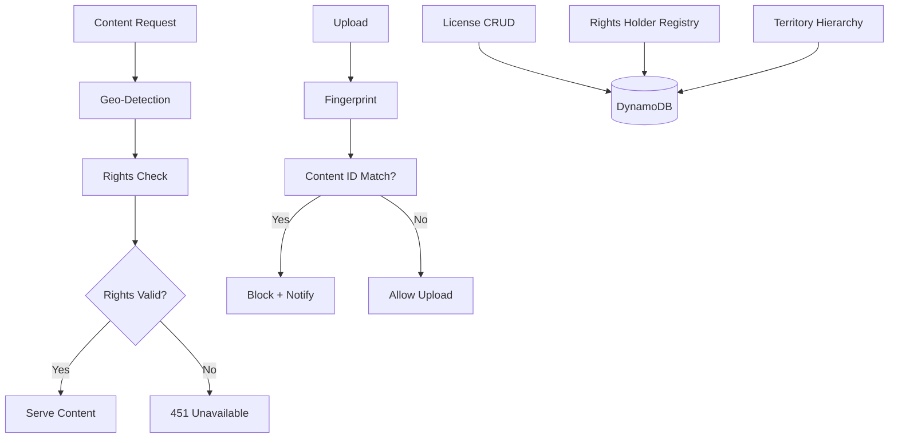

# Design Document: Rights Management Foundation

## Overview

This design establishes comprehensive content rights management across geographic scopes (local, regional, national, global). It includes rights database schema, territory hierarchy, license tracking, geo-detection, and content identification integration using Marengo (WS2) for visual fingerprinting.

## Steering Document Alignment

### Technical Standards
- Go 1.22+ for backend services
- DynamoDB for rights data
- MaxMind GeoIP for location detection
- Integration with existing Track/Artist models

### Project Structure
- Backend: `backend/internal/models/rights.go`, `backend/internal/service/rights/`
- Repository: `backend/internal/repository/rights.go`
- Handlers: `backend/internal/handlers/rights.go`
- Infrastructure: `infrastructure/backend/rights.tf`

## Code Reuse Analysis

### Existing Components to Leverage
- **Artist Entity (WS1)**: Rights holder can reference Artist
- **Track Model**: Extend with rights fields
- **Marengo (WS2)**: Content fingerprinting for copyright detection
- **Auth Middleware**: Extend with geo-detection

### Integration Points
- **DynamoDB**: Rights tables in single-table design
- **CloudFront**: Geo-detection headers
- **S3**: Store rights documentation
- **Marengo Embeddings**: Content identification

## Architecture



### Modular Design Principles
- **Single File Responsibility**: RightsService, LicenseService, TerritoryService, GeoService separate
- **Component Isolation**: Rights checking is middleware, not embedded in handlers
- **Service Layer Separation**: Repository for data, Service for business rules
- **Utility Modularity**: ISO country codes, PRO mappings as separate data files

## Components and Interfaces

### Rights Service (Backend)
- **Purpose:** Check and manage track rights
- **Interfaces:**
  ```go
  type RightsService interface {
      GetTrackRights(ctx context.Context, trackID string) ([]*TrackRights, error)
      SetTrackRights(ctx context.Context, trackID string, rights []TrackRightsInput) error
      CheckAccess(ctx context.Context, trackID, userID, territory string) (*AccessResult, error)
      GetRightsHolders(ctx context.Context, trackID string) ([]*RightsHolder, error)
  }
  ```
- **Dependencies:** RightsRepository, TerritoryService

### License Service (Backend)
- **Purpose:** Track licenses and expirations
- **Interfaces:**
  ```go
  type LicenseService interface {
      CreateLicense(ctx context.Context, input CreateLicenseInput) (*License, error)
      GetLicense(ctx context.Context, licenseID string) (*License, error)
      ListLicenses(ctx context.Context, filters LicenseFilters) ([]*License, error)
      UpdateLicense(ctx context.Context, licenseID string, input UpdateLicenseInput) (*License, error)
      RevokeLicense(ctx context.Context, licenseID string, reason string) error
      GetExpiringLicenses(ctx context.Context, days int) ([]*License, error)
  }
  ```
- **Dependencies:** LicenseRepository

### Territory Service (Backend)
- **Purpose:** Manage territory hierarchy and resolution
- **Interfaces:**
  ```go
  type TerritoryService interface {
      GetTerritory(ctx context.Context, code string) (*Territory, error)
      ResolveHierarchy(ctx context.Context, code string) ([]*Territory, error)
      GetPROForTerritory(ctx context.Context, code string) (*PRO, error)
      GetRoyaltyRates(ctx context.Context, code string, rightType string) (*RoyaltyRate, error)
  }
  ```
- **Dependencies:** TerritoryRepository

### Geo Service (Backend)
- **Purpose:** Detect user location
- **Interfaces:**
  ```go
  type GeoService interface {
      DetectLocation(ctx context.Context, ip string) (*Location, error)
      GetTerritoryCode(ctx context.Context, ip string) (string, error)
      IsVPNDetected(ctx context.Context, ip string) bool
  }
  ```
- **Dependencies:** MaxMind GeoIP database

### Content ID Service (Backend)
- **Purpose:** Identify copyrighted content on upload
- **Interfaces:**
  ```go
  type ContentIDService interface {
      CheckAudioFingerprint(ctx context.Context, trackID string) (*ContentMatch, error)
      CheckVideoFingerprint(ctx context.Context, videoID string) (*ContentMatch, error)
      RegisterFingerprint(ctx context.Context, trackID string, rightsHolder string) error
      FileDispute(ctx context.Context, matchID string, claim DisputeClaim) error
  }
  ```
- **Dependencies:** MarengoClient (WS2), Fingerprint database

## Data Models

### TrackRights
```go
type TrackRights struct {
    ID           string    `dynamodbav:"id" json:"id"`
    TrackID      string    `dynamodbav:"trackId" json:"trackId"`
    HolderID     string    `dynamodbav:"holderId" json:"holderId"`
    RightType    RightType `dynamodbav:"rightType" json:"rightType"`
    SharePercent float64   `dynamodbav:"sharePercent" json:"sharePercent"`
    Territories  []string  `dynamodbav:"territories" json:"territories"`
    StartDate    *time.Time `dynamodbav:"startDate,omitempty" json:"startDate,omitempty"`
    EndDate      *time.Time `dynamodbav:"endDate,omitempty" json:"endDate,omitempty"`
    Restrictions map[string]interface{} `dynamodbav:"restrictions,omitempty" json:"restrictions,omitempty"`
    CreatedAt    time.Time `dynamodbav:"createdAt" json:"createdAt"`
    UpdatedAt    time.Time `dynamodbav:"updatedAt" json:"updatedAt"`
}

type RightType string

const (
    RightMechanical  RightType = "mechanical"
    RightPerformance RightType = "performance"
    RightSync        RightType = "sync"
    RightMaster      RightType = "master"
    RightPrint       RightType = "print"
    RightNeighboring RightType = "neighboring"
)

// DynamoDB Keys: PK=TRACK#{trackId}, SK=RIGHTS#{rightType}#{holderId}
```

### Territory
```go
type Territory struct {
    Code       string  `dynamodbav:"code" json:"code"`       // ISO code or LOC:xxx
    Name       string  `dynamodbav:"name" json:"name"`
    Scope      Scope   `dynamodbav:"scope" json:"scope"`     // global, national, regional, local
    ParentCode *string `dynamodbav:"parentCode,omitempty" json:"parentCode,omitempty"`
    PROID      *string `dynamodbav:"proId,omitempty" json:"proId,omitempty"`
    RoyaltyRates map[RightType]float64 `dynamodbav:"royaltyRates,omitempty" json:"royaltyRates,omitempty"`
}

type Scope string

const (
    ScopeGlobal   Scope = "global"
    ScopeNational Scope = "national"
    ScopeRegional Scope = "regional"
    ScopeLocal    Scope = "local"
)

// DynamoDB Keys: PK=TERRITORY, SK=CODE#{code}
```

### RightsHolder
```go
type RightsHolder struct {
    ID          string   `dynamodbav:"id" json:"id"`
    Name        string   `dynamodbav:"name" json:"name"`
    Type        HolderType `dynamodbav:"type" json:"type"`
    Territories []string `dynamodbav:"territories" json:"territories"`
    IPINumber   *string  `dynamodbav:"ipiNumber,omitempty" json:"ipiNumber,omitempty"`
    ISNI        *string  `dynamodbav:"isni,omitempty" json:"isni,omitempty"`
    ArtistID    *string  `dynamodbav:"artistId,omitempty" json:"artistId,omitempty"` // Links to WS1
    PaymentInfo *PaymentInfo `dynamodbav:"paymentInfo,omitempty" json:"-"` // Encrypted
    IsActive    bool     `dynamodbav:"isActive" json:"isActive"`
    CreatedAt   time.Time `dynamodbav:"createdAt" json:"createdAt"`
}

type HolderType string

const (
    HolderLabel      HolderType = "label"
    HolderPublisher  HolderType = "publisher"
    HolderPRO        HolderType = "pro"
    HolderDistributor HolderType = "distributor"
    HolderArtist     HolderType = "artist"
)

// DynamoDB Keys: PK=RIGHTSHOLDER, SK=HOLDER#{id}
```

### License
```go
type License struct {
    ID          string    `dynamodbav:"id" json:"id"`
    TrackID     string    `dynamodbav:"trackId" json:"trackId"`
    LicenseeID  string    `dynamodbav:"licenseeId" json:"licenseeId"`
    RightType   RightType `dynamodbav:"rightType" json:"rightType"`
    Territories []string  `dynamodbav:"territories" json:"territories"`
    StartDate   time.Time `dynamodbav:"startDate" json:"startDate"`
    EndDate     time.Time `dynamodbav:"endDate" json:"endDate"`
    AutoRenew   bool      `dynamodbav:"autoRenew" json:"autoRenew"`
    Terms       map[string]interface{} `dynamodbav:"terms" json:"terms"`
    Fee         int       `dynamodbav:"fee" json:"fee"` // cents
    Currency    string    `dynamodbav:"currency" json:"currency"`
    Status      LicenseStatus `dynamodbav:"status" json:"status"`
    CreatedAt   time.Time `dynamodbav:"createdAt" json:"createdAt"`
}

type LicenseStatus string

const (
    LicenseActive     LicenseStatus = "active"
    LicenseExpired    LicenseStatus = "expired"
    LicensePending    LicenseStatus = "pending"
    LicenseTerminated LicenseStatus = "terminated"
)

// DynamoDB Keys: PK=LICENSE, SK=#{id}
// GSI: PK=TRACK#{trackId}, SK=LICENSE#{id}
```

### AccessResult
```go
type AccessResult struct {
    Allowed     bool     `json:"allowed"`
    Reason      string   `json:"reason,omitempty"`
    Restrictions []string `json:"restrictions,omitempty"`
    Territory   string   `json:"territory"`
}
```

## API Endpoints

### Rights Management
| Method | Path | Description |
|--------|------|-------------|
| GET | `/api/v1/tracks/:id/rights` | Get rights for track |
| PUT | `/api/v1/tracks/:id/rights` | Set rights for track |
| GET | `/api/v1/rights-holders` | List rights holders |
| POST | `/api/v1/rights-holders` | Create rights holder |

### Licenses
| Method | Path | Description |
|--------|------|-------------|
| GET | `/api/v1/licenses` | List licenses |
| POST | `/api/v1/licenses` | Create license |
| GET | `/api/v1/licenses/:id` | Get license details |
| PUT | `/api/v1/licenses/:id` | Update license |
| DELETE | `/api/v1/licenses/:id` | Revoke license |

### Territories
| Method | Path | Description |
|--------|------|-------------|
| GET | `/api/v1/territories` | List territories |
| GET | `/api/v1/territories/:code` | Get territory details |
| GET | `/api/v1/territories/:code/hierarchy` | Get territory hierarchy |

### Content ID
| Method | Path | Description |
|--------|------|-------------|
| POST | `/api/v1/content-id/check` | Check content for matches |
| POST | `/api/v1/content-id/dispute` | File content dispute |
| GET | `/api/v1/content-id/disputes` | List user's disputes |

## Geo-Detection Middleware

```go
func GeoMiddleware(geoService GeoService) echo.MiddlewareFunc {
    return func(next echo.HandlerFunc) echo.HandlerFunc {
        return func(c echo.Context) error {
            // Get IP from CloudFront header or request
            ip := c.Request().Header.Get("CloudFront-Viewer-Country")
            if ip == "" {
                ip = c.RealIP()
            }

            territory, err := geoService.GetTerritoryCode(c.Request().Context(), ip)
            if err != nil {
                territory = "UNKNOWN"
            }

            c.Set("territory", territory)
            return next(c)
        }
    }
}
```

## Error Handling

### Error Scenarios
1. **Content Blocked in Territory**
   - **Handling:** Return 451 (Unavailable for Legal Reasons)
   - **User Impact:** "This content is not available in your region"

2. **Rights Conflict Detected**
   - **Handling:** Block playback, log conflict, notify admin
   - **User Impact:** "Rights verification in progress"

3. **License Expired**
   - **Handling:** Block content, send renewal notification
   - **User Impact:** Content disappears from listings

4. **Copyright Match on Upload**
   - **Handling:** Block upload, show matched content
   - **User Impact:** "This content matches [Artist - Title]. Do you own the rights?"

## Testing Strategy

### Unit Testing
- Territory hierarchy resolution
- Rights checking logic with various scenarios
- License expiration calculations
- Share percentage validation (must sum to 100)

### Integration Testing
- Geo-detection with mock IPs
- Rights check → content access flow
- License CRUD operations
- Content ID with Marengo embeddings

### End-to-End Testing
- Upload → Copyright check → Block or Allow
- User in blocked territory → 451 response
- License expiration → Content unavailable
- Rights conflict → Admin notification
