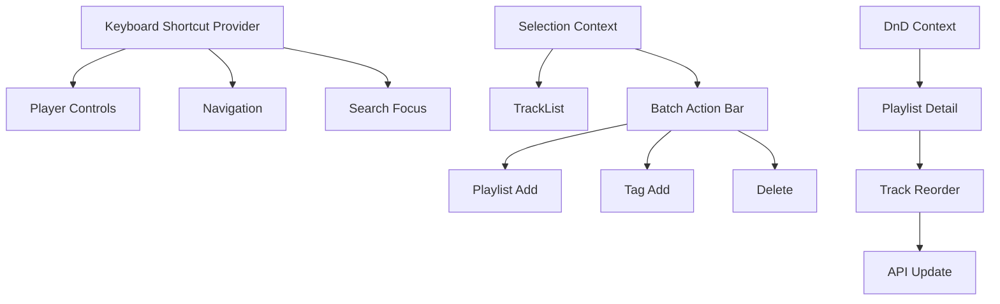

# Design Document: UI/UX Improvements

## Overview

This design covers frontend usability enhancements: keyboard shortcuts, drag-and-drop playlist reordering, batch operations, and mobile responsiveness. All features are pure frontend with minimal backend changes required.

## Steering Document Alignment

### Technical Standards
- React 18 with TypeScript
- TanStack Router/Query
- DaisyUI 5 + Tailwind CSS
- @dnd-kit for drag and drop

### Project Structure
- Hooks: `frontend/src/hooks/useKeyboard.ts`, `frontend/src/hooks/useBatchSelection.ts`
- Components: `frontend/src/components/ui/`
- Context: `frontend/src/lib/context/SelectionContext.tsx`

## Code Reuse Analysis

### Existing Components to Leverage
- **TrackList.tsx**: Add selection checkboxes, drag handles
- **PlayerBar.tsx**: Keyboard shortcut integration
- **Sidebar.tsx**: Mobile hamburger menu already exists
- **usePlayerStore**: Keyboard shortcut actions

### Integration Points
- **TanStack Query**: Optimistic updates for drag reorder
- **DaisyUI**: Consistent component styling
- **localStorage**: Persist preferences

## Architecture



### Modular Design Principles
- **Single File Responsibility**: KeyboardShortcuts hook, BatchSelection context, DragDrop wrapper
- **Component Isolation**: Each feature is independently toggleable
- **Service Layer Separation**: UI logic in hooks, API calls in mutations
- **Utility Modularity**: Shared mobile detection, gesture handling

## Components and Interfaces

### useKeyboardShortcuts Hook
- **Purpose:** Global keyboard shortcut handling
- **Interfaces:**
  ```typescript
  interface UseKeyboardShortcuts {
    registerShortcut: (key: string, action: () => void, options?: ShortcutOptions) => void;
    unregisterShortcut: (key: string) => void;
    isEnabled: boolean;
    setEnabled: (enabled: boolean) => void;
  }

  interface ShortcutOptions {
    ctrl?: boolean;
    shift?: boolean;
    alt?: boolean;
    meta?: boolean;
    preventDefault?: boolean;
    allowInInput?: boolean;
  }
  ```
- **Dependencies:** React event system

### SelectionContext
- **Purpose:** Manage multi-select state across track lists
- **Interfaces:**
  ```typescript
  interface SelectionContextValue {
    selectedIds: Set<string>;
    isSelected: (id: string) => boolean;
    select: (id: string) => void;
    deselect: (id: string) => void;
    toggle: (id: string) => void;
    selectRange: (fromId: string, toId: string, items: string[]) => void;
    selectAll: (items: string[]) => void;
    clearSelection: () => void;
    selectionCount: number;
  }
  ```
- **Dependencies:** React Context

### DraggableTrackList
- **Purpose:** Reorderable track list for playlists
- **Interfaces:**
  ```typescript
  interface DraggableTrackListProps {
    tracks: Track[];
    playlistId: string;
    onReorder: (fromIndex: number, toIndex: number) => void;
    isReorderable?: boolean;
  }
  ```
- **Dependencies:** @dnd-kit/core, @dnd-kit/sortable

### BatchActionBar
- **Purpose:** Action bar for batch operations
- **Interfaces:**
  ```typescript
  interface BatchActionBarProps {
    selectedCount: number;
    onAddToPlaylist: (playlistId: string) => void;
    onAddTags: (tags: string[]) => void;
    onDelete: () => void;
    onClearSelection: () => void;
  }
  ```
- **Dependencies:** SelectionContext

### MobileNav
- **Purpose:** Mobile-optimized navigation
- **Interfaces:**
  ```typescript
  interface MobileNavProps {
    isOpen: boolean;
    onClose: () => void;
    currentPath: string;
  }
  ```
- **Reuses:** Existing Sidebar navigation items

## Data Models

### ShortcutMap
```typescript
const DEFAULT_SHORTCUTS: Record<string, ShortcutConfig> = {
  'Space': { action: 'togglePlayPause', description: 'Play/Pause' },
  'ArrowLeft': { action: 'previousTrack', description: 'Previous track' },
  'ArrowRight': { action: 'nextTrack', description: 'Next track' },
  'ArrowUp': { action: 'volumeUp', description: 'Volume up' },
  'ArrowDown': { action: 'volumeDown', description: 'Volume down' },
  '/': { action: 'focusSearch', description: 'Focus search' },
  'Meta+k': { action: 'focusSearch', description: 'Focus search (Mac)' },
  'm': { action: 'toggleMute', description: 'Mute/Unmute' },
  's': { action: 'toggleShuffle', description: 'Toggle shuffle' },
  'r': { action: 'cycleRepeat', description: 'Cycle repeat mode' },
  'Escape': { action: 'closeModal', description: 'Close modal/dropdown' },
  '?': { action: 'showShortcuts', description: 'Show shortcuts' },
};
```

### BatchOperation
```typescript
interface BatchOperation {
  type: 'addToPlaylist' | 'addTags' | 'delete';
  trackIds: string[];
  payload?: {
    playlistId?: string;
    tags?: string[];
  };
}

interface BatchResult {
  success: number;
  failed: number;
  errors: Array<{ trackId: string; error: string }>;
}
```

### UserPreferences
```typescript
interface UserPreferences {
  theme: 'light' | 'dark' | 'system';
  sidebarVisible: boolean;
  trackListColumns: string[];  // visible column keys
  shortcutsEnabled: boolean;
}
```

## Mobile Breakpoints

```typescript
const BREAKPOINTS = {
  sm: 640,   // Mobile
  md: 768,   // Tablet
  lg: 1024,  // Desktop
  xl: 1280,  // Large desktop
};

// Track list switches to card view below md
// Sidebar collapses to hamburger below md
// Player bar stacks vertically below sm
// Search becomes full-screen overlay below md
```

## Keyboard Shortcuts Reference Modal

```typescript
interface ShortcutsModalProps {
  isOpen: boolean;
  onClose: () => void;
}

// Groups:
// - Playback: Space, ←, →, M
// - Volume: ↑, ↓
// - Navigation: /, Cmd+K
// - Modes: S, R
// - General: Esc, ?
```

## Error Handling

### Error Scenarios
1. **Batch Operation Partial Failure**
   - **Handling:** Complete successful operations, report failures
   - **User Impact:** "12 of 15 tracks added. 3 failed: [details]"

2. **Drag Reorder API Failure**
   - **Handling:** Revert to original order, show error toast
   - **User Impact:** List snaps back with "Failed to reorder" message

3. **Keyboard Shortcut Conflict**
   - **Handling:** Disable in input fields, check for browser conflicts
   - **User Impact:** Shortcuts work outside inputs only

4. **Touch Gesture Misfire**
   - **Handling:** Require deliberate gesture (long press, swipe threshold)
   - **User Impact:** Accidental touches don't trigger actions

## Testing Strategy

### Unit Testing
- Keyboard shortcut registration and firing
- Selection context state management
- Batch operation result aggregation
- Mobile breakpoint detection

### Integration Testing
- Drag reorder with optimistic update and rollback
- Batch add to playlist with API
- Keyboard navigation through track list
- Mobile hamburger menu open/close

### End-to-End Testing
- Full keyboard-only navigation flow
- Select multiple → Batch add to playlist → Verify
- Drag reorder in playlist → Verify order persists
- Mobile swipe to delete → Confirm → Verify

### Accessibility Testing
- Screen reader navigation
- Focus management
- Color contrast verification
- WCAG 2.1 AA compliance check
