# Design Document: User Services

## Overview

This feature establishes DynamoDB as the source of truth for user data with automatic synchronization from Cognito. A Lambda trigger creates DynamoDB profiles on signup, and role changes update both systems atomically. This enables efficient admin operations without Cognito API dependencies.

## Steering Document Alignment

### Technical Standards
- Go Lambda functions with ARM64 architecture
- DynamoDB single-table design with GSI for email search
- Echo handlers following existing patterns
- OpenTofu for Lambda trigger infrastructure

### Project Structure
- Lambda trigger in `backend/cmd/triggers/post-confirmation/`
- UserService extended in `backend/internal/service/`
- Repository methods in `backend/internal/repository/`
- Infrastructure in `infrastructure/shared/`

## Code Reuse Analysis

### Existing Components to Leverage
- **AdminService**: Extend with DynamoDB-powered search
- **CognitoClient**: Already has group management methods
- **Repository**: Existing user CRUD operations
- **Models**: User model with role field

### Integration Points
- **Cognito User Pool**: Add post-confirmation trigger
- **DynamoDB**: Add GSI1 for email prefix search
- **Admin Panel**: Update to use DynamoDB search

---

## Architecture

```mermaid
graph TD
    subgraph "User Signup Flow"
        A[Cognito Signup] --> B[Post-Confirmation Trigger]
        B --> C[Lambda: CreateUserProfile]
        C --> D[DynamoDB: Create User]
        C --> E[Cognito: Add to subscriber group]
    end

    subgraph "Role Change Flow"
        F[Admin Panel] --> G[PUT /admin/users/:id/role]
        G --> H[AdminService.UpdateUserRole]
        H --> I[DynamoDB: Update role]
        I --> J{Success?}
        J -->|Yes| K[Cognito: Update groups]
        K --> L{Success?}
        L -->|No| M[Rollback DynamoDB]
        L -->|Yes| N[Return success]
        J -->|No| O[Return error]
    end

    subgraph "User Search Flow"
        P[Admin Search] --> Q[GET /admin/users?search=]
        Q --> R[DynamoDB: Query GSI1]
        R --> S[Return results]
    end
```



### Modular Design Principles
- **Single File Responsibility**: Trigger Lambda separate from API Lambda
- **Component Isolation**: UserService handles user operations only
- **Service Layer Separation**: Repository for data, service for logic
- **Utility Modularity**: Settings validation in separate module

---

## Components and Interfaces

### Component 1: Post-Confirmation Lambda
- **Purpose**: Create DynamoDB user profile on Cognito signup
- **Interfaces**:
  ```go
  // Lambda handler
  func HandlePostConfirmation(ctx context.Context, event events.CognitoEventUserPoolsPostConfirmation) (events.CognitoEventUserPoolsPostConfirmation, error)
  ```
- **Dependencies**: DynamoDB client, Cognito client
- **Reuses**: Existing User model

### Component 2: UserService (Extended)
- **Purpose**: Manage user operations with DynamoDB as source of truth
- **Interfaces**:
  ```go
  type UserService interface {
    // Existing
    GetUser(ctx context.Context, userID string) (*models.User, error)
    UpdateUser(ctx context.Context, userID string, req UpdateUserRequest) (*models.User, error)

    // New
    CreateUserFromCognito(ctx context.Context, cognitoEvent CognitoUserInfo) (*models.User, error)
    GetUserSettings(ctx context.Context, userID string) (*models.UserSettings, error)
    UpdateUserSettings(ctx context.Context, userID string, settings models.UserSettings) error
    SearchUsers(ctx context.Context, query SearchUsersQuery) (*PaginatedUsers, error)
  }
  ```
- **Dependencies**: Repository, CognitoClient
- **Reuses**: Existing repository patterns

### Component 3: UserRepository (Extended)
- **Purpose**: DynamoDB operations for users
- **Interfaces**:
  ```go
  type UserRepository interface {
    // Existing
    GetUser(ctx context.Context, userID string) (*models.User, error)
    CreateUser(ctx context.Context, user *models.User) error
    UpdateUser(ctx context.Context, user *models.User) error

    // New
    SearchUsersByEmail(ctx context.Context, emailPrefix string, limit int, cursor string) (*PaginatedResult[models.User], error)
    SearchUsersByName(ctx context.Context, nameContains string, limit int, cursor string) (*PaginatedResult[models.User], error)
    UpdateUserSettings(ctx context.Context, userID string, settings models.UserSettings) error
  }
  ```
- **Dependencies**: DynamoDB client
- **Reuses**: Existing DynamoDB patterns

### Component 4: Settings Handlers
- **Purpose**: API endpoints for user settings
- **Interfaces**:
  ```go
  // GET /api/v1/users/me/settings
  func (h *Handlers) GetMySettings(c echo.Context) error

  // PATCH /api/v1/users/me/settings
  func (h *Handlers) UpdateMySettings(c echo.Context) error
  ```
- **Dependencies**: UserService
- **Reuses**: Existing handler patterns

---

## Data Models

### User (Updated)
```go
type User struct {
    ID             string       `json:"id" dynamodbav:"id"`
    Email          string       `json:"email" dynamodbav:"email"`
    DisplayName    string       `json:"displayName" dynamodbav:"displayName"`
    AvatarURL      string       `json:"avatarUrl,omitempty" dynamodbav:"avatarUrl,omitempty"`
    Role           UserRole     `json:"role" dynamodbav:"role"`
    Disabled       bool         `json:"disabled" dynamodbav:"disabled"`
    Settings       UserSettings `json:"settings" dynamodbav:"settings"`
    CreatedAt      time.Time    `json:"createdAt" dynamodbav:"createdAt"`
    UpdatedAt      time.Time    `json:"updatedAt" dynamodbav:"updatedAt"`
    LastLoginAt    *time.Time   `json:"lastLoginAt,omitempty" dynamodbav:"lastLoginAt,omitempty"`

    // Counts
    TrackCount     int          `json:"trackCount" dynamodbav:"trackCount"`
    PlaylistCount  int          `json:"playlistCount" dynamodbav:"playlistCount"`
    AlbumCount     int          `json:"albumCount" dynamodbav:"albumCount"`
    FollowerCount  int          `json:"followerCount" dynamodbav:"followerCount"`
    FollowingCount int          `json:"followingCount" dynamodbav:"followingCount"`
    StorageUsed    int64        `json:"storageUsed" dynamodbav:"storageUsed"`
}
```

### UserSettings
```go
type UserSettings struct {
    Theme         string              `json:"theme" dynamodbav:"theme"`                   // "light", "dark", "system"
    Notifications NotificationSettings `json:"notifications" dynamodbav:"notifications"`
    Privacy       PrivacySettings      `json:"privacy" dynamodbav:"privacy"`
    Player        PlayerSettings       `json:"player" dynamodbav:"player"`
}

type NotificationSettings struct {
    Email bool `json:"email" dynamodbav:"email"`
    Push  bool `json:"push" dynamodbav:"push"`
}

type PrivacySettings struct {
    ShowActivity bool `json:"showActivity" dynamodbav:"showActivity"`
    AllowFollows bool `json:"allowFollows" dynamodbav:"allowFollows"`
}

type PlayerSettings struct {
    Autoplay        bool `json:"autoplay" dynamodbav:"autoplay"`
    Crossfade       int  `json:"crossfade" dynamodbav:"crossfade"` // seconds
    NormalizeVolume bool `json:"normalizeVolume" dynamodbav:"normalizeVolume"`
}
```

### UserItem (DynamoDB)
```go
type UserItem struct {
    PK     string `dynamodbav:"PK"`     // USER#{userId}
    SK     string `dynamodbav:"SK"`     // PROFILE
    GSI1PK string `dynamodbav:"GSI1PK"` // EMAIL#{email}
    GSI1SK string `dynamodbav:"GSI1SK"` // USER
    Type   string `dynamodbav:"Type"`   // USER

    User
}
```

---

## DynamoDB Access Patterns

### New GSI for Email Search
| Access Pattern | Index | Key Condition |
|----------------|-------|---------------|
| Search by email prefix | GSI1 | `GSI1PK begins_with "EMAIL#prefix"` |
| Get user by email | GSI1 | `GSI1PK = "EMAIL#email"` |

### GSI1 Configuration
```hcl
global_secondary_index {
  name            = "GSI1"
  hash_key        = "GSI1PK"
  range_key       = "GSI1SK"
  projection_type = "ALL"
}
```

---

## API Endpoints

### New Endpoints
| Method | Path | Description | Auth |
|--------|------|-------------|------|
| GET | `/api/v1/users/me/settings` | Get current user's settings | Authenticated |
| PATCH | `/api/v1/users/me/settings` | Update settings (partial) | Authenticated |

### Updated Endpoints
| Method | Path | Change |
|--------|------|--------|
| GET | `/api/v1/admin/users` | Use DynamoDB instead of Cognito |

---

## Lambda Trigger Configuration

### Post-Confirmation Trigger
```hcl
resource "aws_lambda_function" "post_confirmation" {
  function_name = "music-library-prod-post-confirmation"
  handler       = "bootstrap"
  runtime       = "provided.al2"
  architectures = ["arm64"]

  environment {
    variables = {
      DYNAMODB_TABLE_NAME = var.dynamodb_table_name
      COGNITO_USER_POOL_ID = var.user_pool_id
    }
  }
}

resource "aws_lambda_permission" "cognito_trigger" {
  statement_id  = "AllowCognitoInvoke"
  action        = "lambda:InvokeFunction"
  function_name = aws_lambda_function.post_confirmation.function_name
  principal     = "cognito-idp.amazonaws.com"
  source_arn    = aws_cognito_user_pool.main.arn
}

resource "aws_cognito_user_pool" "main" {
  # ... existing config ...

  lambda_config {
    post_confirmation = aws_lambda_function.post_confirmation.arn
  }
}
```

---

## Error Handling

### Error Scenarios

1. **DynamoDB write fails on signup**
   - **Handling**: Log error, allow signup to complete
   - **User Impact**: User can sign in; profile created on first API call

2. **Role change - Cognito update fails**
   - **Handling**: Rollback DynamoDB change, return error
   - **User Impact**: Role unchanged, admin sees error message

3. **Duplicate email in DynamoDB**
   - **Handling**: Update existing record instead of create
   - **User Impact**: None (idempotent)

4. **Settings validation fails**
   - **Handling**: Return 400 with validation errors
   - **User Impact**: Settings not saved, shown which fields are invalid

---

## Migration Script

### Backfill Script Design
```bash
#!/bin/bash
# scripts/migrations/backfill-cognito-users.sh

# 1. List all Cognito users
# 2. For each user:
#    - Check if DynamoDB profile exists
#    - If not, create with defaults
# 3. Report summary
```

```go
// cmd/migrations/backfill-users/main.go
func main() {
    // Parse flags: --dry-run, --limit, --start-token
    // List Cognito users with pagination
    // For each user:
    //   - Check DynamoDB for existing profile
    //   - If missing, create with defaults
    //   - Log progress
    // Print summary
}
```

---

## Testing Strategy

### Unit Testing
- UserService: test CreateUserFromCognito, settings CRUD
- Repository: test email search with mock DynamoDB
- Settings validation: test all field constraints

### Integration Testing
- Post-confirmation Lambda: test with mock Cognito event
- Role change: test atomic update with rollback
- Search: test prefix matching and pagination

### End-to-End Testing
- Sign up new user → verify DynamoDB profile created
- Change role → verify both systems updated
- Search users → verify results match expectations
